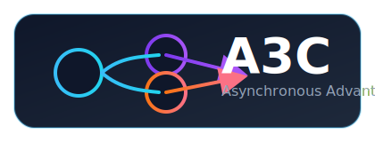

  

# A3C (Asynchronous Advantage Actor-Critic) quickstart

## What is A3C?
- A3C launches multiple environment workers that run in parallel, each maintaining a local copy of the policy/value network.
- After every `t_max` steps (or episode termination) workers push gradients to a shared global network, enabling on-policy updates without heavy experience replay.

This template includes:
- YAML-backed `Config` class at `A3C/a3c/config.py` with defaults in `A3C/configs/`
- Shared Adam optimizer and multiprocessing worker loop (`A3C/a3c/worker.py`)
- tqdm-friendly logging and Weights & Biases instrumentation
- Periodic & best checkpoint saving compatible with other algorithms in this repo
- CLI powered by Fire with `train` and `demo` entrypoints (`A3C/main.py`)

Getting started (Windows cmd using uv):
1) Create venv and install deps
   uv venv .venv
   uv sync

2) Train A3C on CartPole with four workers
   uv run -m A3C.main train --config A3C/configs/cartpole.yaml

3) Demo a trained policy (renders a window)
   uv run -m A3C.main demo --config A3C/configs/cartpole.yaml --model_path A3C/checkpoints/best.pt --episodes 5

Notes
- This reference implementation currently supports CPU devices, flat observation spaces, and discrete action spaces.
- Increase `num_workers` and `t_max` carefully; CPU contention can hurt performance.
- Tweak exploration via `entropy_coef` in the config to balance return and stability.

