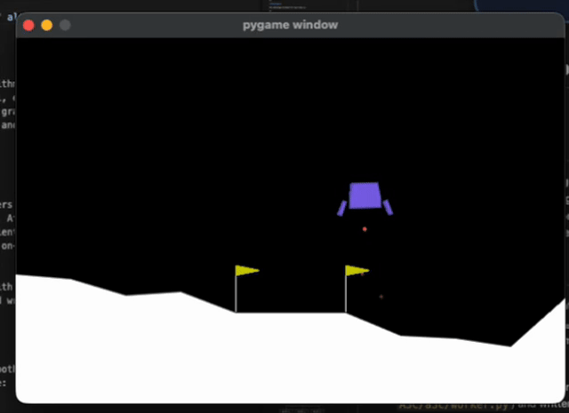
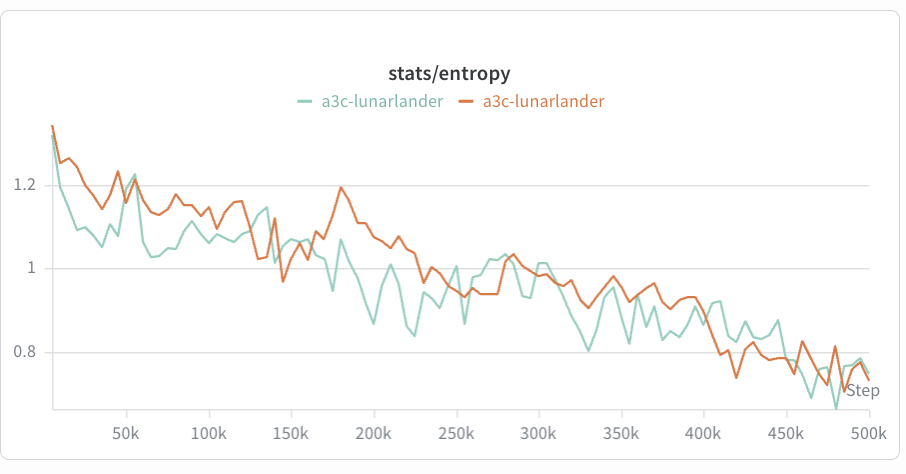
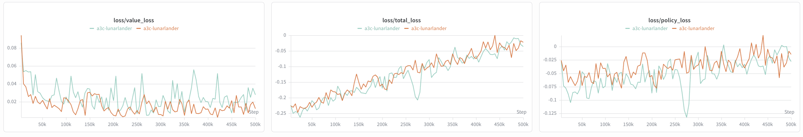
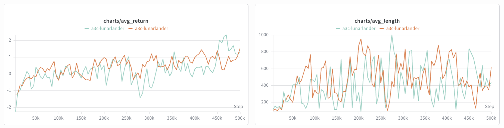

<p align="center">
  
</p>

# A3C (Asynchronous Advantage Actor-Critic)

<p align="center">
  
</p>

## Overview
A3C is an on-policy actor-critic algorithm that achieves stable, efficient training by running multiple workers in parallel, each interacting with its own copy of the environment and asynchronously pushing gradients to a shared global network. This removes the need for experience replay and decorrelates data through parallelism rather than a replay buffer.

## What is A3C?

A3C launches multiple environment workers that run in parallel, each maintaining a local copy of the policy/value network. After every $t_{\max}$ steps (or episode termination) each worker computes gradients on its local trajectory and applies them to the shared global network, enabling on-policy updates without heavy experience replay.

Below is a compact math view aligned with this repository's implementation (see `A3C/a3c/agent.py`, `A3C/a3c/worker.py`) and written to render in both VSCode Markdown preview and GitHub.

**Actor-Critic architecture**

The shared network $f_\theta$ outputs both a policy (actor) and a value estimate (critic) from a common feature backbone:

$$
\pi_\theta(a \mid s) = \text{softmax}\!\left(W_\pi \cdot h_\theta(s) + b_\pi\right)
$$

$$
V_\theta(s) = W_v \cdot h_\theta(s) + b_v
$$

where $h_\theta(s)$ is the shared feature representation (MLP backbone).

**N-step return**

Each worker collects a trajectory of up to $t_{\max}$ steps. The n-step return for step $t$ within the rollout is:

$$
R_t = \sum_{k=0}^{n-1} \gamma^k r_{t+k} + \gamma^n V_\theta(s_{t+n}) \cdot (1 - d_{t+n})
$$

where $d_{t+n} \in \{0,1\}$ is the terminal indicator. In this implementation, returns are computed backwards via:

$$
R_t = r_t + \gamma (1 - d_t) \cdot R_{t+1}, \quad R_{T} = V_\theta(s_T)
$$

**Advantage**

The advantage estimate for each step is:

$$
A_t = R_t - V_\theta(s_t)
$$

**Policy loss (actor)**

The policy gradient loss uses the log-probability weighted by the advantage (with stop-gradient on $A_t$):

$$
\mathcal{L}_\pi = -\mathbb{E}_t\!\left[\log \pi_\theta(a_t \mid s_t) \cdot A_t\right]
$$

**Value loss (critic)**

The value function is trained to predict the n-step return:

$$
\mathcal{L}_V = \mathbb{E}_t\!\left[\left(V_\theta(s_t) - R_t\right)^2\right]
$$

**Entropy bonus**

An entropy bonus encourages exploration by preventing premature policy collapse:

$$
\mathcal{H}(\pi_\theta(\cdot \mid s_t)) = -\sum_a \pi_\theta(a \mid s_t) \log \pi_\theta(a \mid s_t)
$$

**Total loss**

The combined loss minimized by each worker is:

$$
\mathcal{L}_{\text{total}} = \mathcal{L}_\pi + c_v \mathcal{L}_V - c_e \mathbb{E}_t\!\left[\mathcal{H}(\pi_\theta(\cdot \mid s_t))\right]
$$

where $c_v$ is the value loss coefficient (`value_loss_coef`) and $c_e$ is the entropy coefficient (`entropy_coef`).

**Asynchronous gradient update**

Each worker $k$ maintains a local copy $\theta'_k$ of the global parameters $\theta$. After each rollout:

1. Sync local parameters: $\theta'_k \leftarrow \theta$
2. Collect trajectory $`\{(s_t, a_t, r_t)\}_{t=0}^{n-1}`$ using $`\pi_{\theta'_k}`$
3. Compute $`\nabla_{\theta'_k} \mathcal{L}_{\text{total}}`$ on local parameters
4. Apply gradients to the global network:

$$
\theta \leftarrow \theta - \alpha \cdot \nabla_{\theta'_k} \mathcal{L}_{\text{total}}
$$

with gradient clipping $\|\nabla\| \leq g_{\max}$ (`max_grad_norm`) before the update. The optimizer is a `SharedAdam` whose state tensors are placed in shared memory so all workers apply updates to the same momentum buffers.

**Parameter/term guide**
- $s_t$, $a_t$, $r_t$: state, action, reward at time $t$; $s_{t+1}$ is the next state.
- $\gamma$: discount factor; $\alpha$: learning rate.
- $\theta$: global (shared) network parameters; $\theta'_k$: local copy for worker $k$.
- $V_\theta(s)$: value function estimate; $\pi_\theta(a \mid s)$: policy (categorical distribution).
- $c_v$: value loss coefficient; $c_e$: entropy bonus coefficient.
- $g_{\max}$: gradient clipping max norm; $t_{\max}$: max rollout length per worker.
- $d_t \in \{0,1\}$: terminal indicator (1 if terminal, 0 otherwise).

## Highlights
- Shared-memory global model with `SharedAdam` optimizer across spawned worker processes via `torch.multiprocessing`.
- N-step returns computed per rollout; no replay buffer needed (on-policy).
- **Multi-environment support**: each worker can run multiple environments in parallel via `SyncVectorEnv` (`num_envs` config), multiplying data throughput.
- Configurable number of parallel workers, rollout length, and entropy regularization.
- WandB integration, tqdm-aware logging, and checkpoint management consistent with other algorithms.

## Default Environment: LunarLander-v3

LunarLander is a classic control environment where a lander must navigate from the top of the screen to a landing pad at the origin:
- **Observation**: 8-dimensional continuous state (position, velocity, angle, angular velocity, leg contact).
- **Actions**: 4 discrete actions (do nothing, fire left engine, fire main engine, fire right engine).
- **Reward**: Ranges from about −400 (crash) to +300 (perfect landing). Positive reward for moving toward the pad and landing softly; negative for crashing or using fuel.
- **Max episode length**: 1000 steps (truncated if not landed).
- **Solved threshold**: +200 average return over 100 episodes.

LunarLander's wide reward range (−400 to +300) makes it challenging for A3C's shared backbone. Three stabilization techniques are used:
1. **Reward scaling** (`reward_scale=0.01`): compresses returns to ~[−4, +3], preventing value gradients from dominating the shared backbone.
2. **Advantage normalization** (`normalize_advantages=True`): makes the policy gradient scale-invariant.
3. **Entropy annealing** (`entropy_coef` 0.15 → 0.01): starts with high exploration to avoid early entropy collapse, then reduces for exploitation.

> **Note:** LunarLander-v3 requires Box2D. Install with: `pip install swig && pip install "gymnasium[box2d]"`

Alternative configs for CartPole-v1 and Acrobot-v1 are also provided under `A3C/configs/`.

### Training charts

<p align="center">
  
</p>
<p align="center">
  
</p>
<p align="center">
  
</p>

## Quickstart
```bash
python -m A3C.main train --config A3C/configs/lunarlander.yaml

python -m A3C.main demo --config A3C/configs/lunarlander.yaml --model_path A3C/checkpoints/best.pt
```
Use `--wandb_key YOUR_KEY` to authenticate for logging, or set `WANDB_API_KEY` in your environment. Checkpoints live in `A3C/checkpoints`, and the moving-average best checkpoint is written to `best.pt`.

Setup with uv (activate the venv if you want to call `python` directly; `uv run` does not require activation):

Windows cmd:
```cmd
uv venv .venv
uv sync
.\.venv\Scripts\activate.bat
python -m A3C.main train --config A3C/configs/lunarlander.yaml
python -m A3C.main demo --config A3C/configs/lunarlander.yaml --model_path A3C/checkpoints/best.pt --episodes 5
```

macOS/Linux (bash or zsh):
```bash
uv venv .venv
uv sync
source .venv/bin/activate
python -m A3C.main train --config A3C/configs/lunarlander.yaml
python -m A3C.main demo --config A3C/configs/lunarlander.yaml --model_path A3C/checkpoints/best.pt --episodes 5
```

If you prefer `uv run` instead of activation:
```bash
uv run -m A3C.main train --config A3C/configs/lunarlander.yaml
uv run -m A3C.main demo --config A3C/configs/lunarlander.yaml --model_path A3C/checkpoints/best.pt --episodes 5
```

## Training Results

**LunarLander-v3** (default, `seed=42`, 500K steps, ~4 min on 4 cores):
- Training best 10-ep avg return: **+262** (above +200 solved threshold)
- Demo avg return over 10 episodes: **+127** (7/10 episodes positive, best +302)

**CartPole-v1** (`seed=42`, 200K steps):
- Converges to **500** (max score) reliably across all seeds

> **Note on reproducibility:** A3C is inherently non-deterministic due to asynchronous worker scheduling. Even with the same seed, results may vary between runs. LunarLander is particularly sensitive — seed 42 converges reliably, while other seeds may be less stable.

## Configuration
YAML files under `A3C/configs/` expose the hyper-parameters (see inline comments in each YAML for options and valid ranges):
- **Environment**: Gym id, render mode.
- **Workers**: number of parallel processes (`num_workers`), environments per worker (`num_envs`), and max rollout length (`t_max`).
- **Training**: total interaction steps, discount factor, entropy coefficient, value loss coefficient, learning rate, gradient clipping, and schedule options (`anneal_lr`, `anneal_entropy`).
- **Stabilization**: reward scaling (`reward_scale`), advantage normalization (`normalize_advantages`), entropy annealing (`anneal_entropy`, `entropy_coef_end`), and reward shaping (`reward_shaping`, Acrobot only).
- **Model**: shared hidden layer sizes and activation for the actor-critic backbone.
- **Logging**: intervals, checkpoint cadence, output paths, and logger behaviour.
- **Inference**: default checkpoint path and number of evaluation episodes.

Clone the provided config in `A3C/configs/` to target other discrete-action Gymnasium tasks. Configs for `CartPole-v1` and `Acrobot-v1` are included.

## Multi-Environment Support
A3C supports parallel environment execution within each worker via Gymnasium's `SyncVectorEnv`. The `num_envs` parameter controls how many environment instances each worker runs simultaneously. The total number of active environments is `num_workers * num_envs`.

```yaml
num_workers: 4   # OS-level processes (async gradient pushes)
num_envs: 4      # environments per worker (vectorized stepping)
# Total: 4 * 4 = 16 environments running concurrently
```

When `num_envs > 1`, each worker step collects transitions from all its environments in a single batched forward pass, then flattens the data for the gradient update. This multiplies data throughput without spawning additional processes.

> **Important:** Each parallel environment runs within the worker process. Since A3C workers are already separate OS processes, keep `num_workers * num_envs` **at or below the number of CPU cores** available on your machine. Check your core count with `nproc` (Linux) or `sysctl -n hw.ncpu` (macOS) and set values accordingly.

## Architecture

```
                           +-------------------+
                           |  Global Network   |
                           | (shared memory)   |
                           |  theta, SharedAdam|
                           +--------+----------+
                                    |
                  +-----------------+-----------------+
                  |                 |                 |
           +------v------+  +------v------+  +------v------+
           |  Worker 0   |  |  Worker 1   |  |  Worker k   |
           | local theta |  | local theta |  | local theta |
           | env 0..E-1  |  | env 0..E-1  |  | env 0..E-1  |
           | (VectorEnv) |  | (VectorEnv) |  | (VectorEnv) |
           +------+------+  +------+------+  +------+------+
                  |                 |                 |
             grads + episodes  grads + episodes  grads + episodes
                  |                 |                 |
                  +-----------------+-----------------+
                                    |
                           +--------v----------+
                           |  Result Queue     |
                           | (main process     |
                           |  logging/ckpt)    |
                           +-------------------+
        E = num_envs per worker; total envs = num_workers * num_envs
```

## Comparison with Other Policy Gradient Methods

| Aspect | A3C | PPO | SAC |
|--------|-----|-----|-----|
| **Update style** | On-policy, async | On-policy, sync | Off-policy |
| **Parallelism** | Multiple processes | Vectorized envs | Single process + replay |
| **Experience reuse** | No replay buffer | No replay buffer | Replay buffer |
| **Action space** | Discrete | Discrete | Continuous |
| **Exploration** | Entropy bonus | Entropy bonus | Maximum entropy framework |
| **Gradient sync** | Async (lock-free) | Synchronous | N/A |

## Tuning Guide

**Worker scaling:** Keep `num_workers` at 4 (default). More workers increase asynchronous gradient staleness — each worker pushes gradients computed against an increasingly outdated copy of the global model. In experiments, 8 workers performed significantly worse than 4 despite higher data throughput. Prefer increasing `num_envs` (vectorized environments within each worker) over `num_workers` if you need more throughput, though `num_envs=1` gave the best convergence in our tests.

**Value loss coefficient (`value_loss_coef`):** Keep at 0.01 with the shared backbone architecture. With the default 0.5, value gradients are ~200x larger than policy gradients, drowning out policy learning entirely. This was the single most critical fix for convergence.

**Wide-reward environments (e.g., LunarLander):** Environments with reward ranges much larger than [−1, +1] need additional stabilization:
- `reward_scale`: compress rewards (e.g., 0.01 for LunarLander's [−400, +300] range)
- `normalize_advantages: true`: makes policy gradient scale-invariant
- `anneal_entropy: true`: start with high entropy (0.1–0.2) to prevent early collapse, decay to 0.01

**LR and entropy annealing interact with `total_steps`:** Both schedules linearly decay to their end value at `total_steps`. Setting `total_steps` too high keeps LR/entropy elevated for too long, preventing exploitation. For LunarLander, 500K steps works well; 2M steps causes divergence because the LR stays too high.

## Notes
- This reference implementation currently supports CPU devices, flat observation spaces, and discrete action spaces.
- A3C's asynchronous gradient updates are inherently less stable than synchronous methods (A2C, PPO). This is a fundamental algorithmic trade-off, not a bug — for maximum stability, consider PPO.
- Unlike PPO which uses synchronized vectorized environments, A3C uses true multiprocessing with independent environment instances per worker.

## References

- **Mnih, V., Badia, A. P., Mirza, M., Graves, A., Lillicrap, T. P., Harber, T., Silver, D., & Kavukcuoglu, K. (2016).** *Asynchronous Methods for Deep Reinforcement Learning.* Proceedings of the 33rd International Conference on Machine Learning (ICML), 48, 1928-1937.
  - Original A3C paper: https://arxiv.org/abs/1602.01783

- **Sutton, R. S. & Barto, A. G. (2018).** *Reinforcement Learning: An Introduction (2nd ed.).* MIT Press.
  - Chapter 13 covers policy gradient methods; Section 13.5 discusses actor-critic architectures.

- **Schulman, J., Moritz, P., Levine, S., Jordan, M. I., & Abbeel, P. (2016).** *High-Dimensional Continuous Control Using Generalized Advantage Estimation.* ICLR 2016.
  - GAE paper relevant to advantage estimation: https://arxiv.org/abs/1506.02438

- **OpenAI Spinning Up - Key Papers in Deep RL:**
  - A3C entry and related algorithms: https://spinningup.openai.com/en/latest/spinningup/keypapers.html

- **Arthur Juliani (2016).** *Simple Reinforcement Learning with Tensorflow Part 8: Asynchronous Actor-Critic Agents (A3C).*
  - Accessible tutorial walkthrough: https://medium.com/emergent-future/simple-reinforcement-learning-with-tensorflow-part-8-asynchronous-actor-critic-agents-a3c-c88f72a5e9f2
