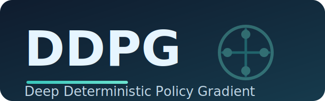

<p align="center">
  
</p>

# Deep Deterministic Policy Gradient (DDPG)

## Overview
DDPG is an off-policy actor-critic method for continuous action spaces that maintains deterministic policies. This implementation mirrors the structure of the other agents in this repository (PPO, SAC, TD3, etc.) with configurable components, shared utilities, and consistent logging.

## Highlights
- Deterministic actor network with a single critic and Polyak-averaged targets.
- Replay buffer warm-up, optional target policy smoothing, and Gaussian exploration noise.
- Integrated tqdm-aware logging, checkpoint helpers, and Weights & Biases tracking.

## Quickstart
```bash
python -m DDPG.main train --config DDPG/configs/pendulum.yaml

python -m DDPG.main demo --config DDPG/configs/pendulum.yaml --model_path DDPG/checkpoints/best.pt
```
Authenticate with WandB via `--wandb_key YOUR_KEY` if you want remote logging. Checkpoints and the moving-average `best.pt` snapshot are written under `DDPG/checkpoints`.

## Configuration
YAML files in `DDPG/configs/` expose hyper-parameters:
- **Environment**: Gym id, render mode, and optional kwargs.
- **Training**: interaction horizon, warm-up steps, replay buffer size, learning rates, Polyak factor, exploration noise, and optional target policy noise.
- **Model**: shared hidden layer sizes and activation for actor and critic.
- **Logging**: logging cadence, checkpoint cadence, output paths, and logger behaviour.
- **Inference**: default checkpoint path and number of evaluation episodes.

Copy `pendulum.yaml` to tailor runs for other continuous control benchmarks.

## References
- Lillicrap et al., Continuous Control with Deep Reinforcement Learning, ICLR 2016 https://arxiv.org/abs/1509.02971
- OpenAI Spinning Up DDPG: https://spinningup.openai.com/en/latest/algorithms/ddpg.html
- Stable-Baselines3 DDPG: https://stable-baselines3.readthedocs.io/en/master/modules/ddpg.html

