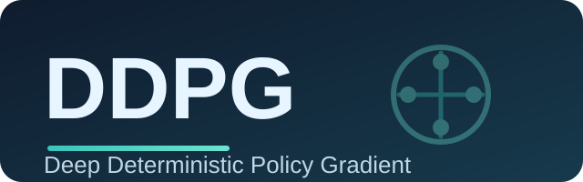
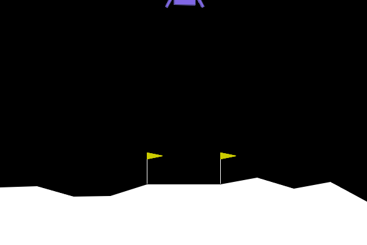
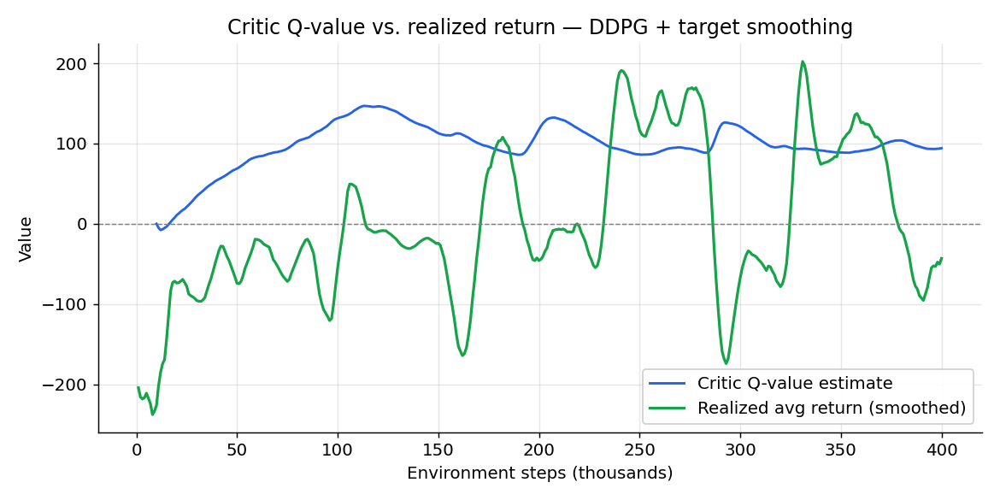
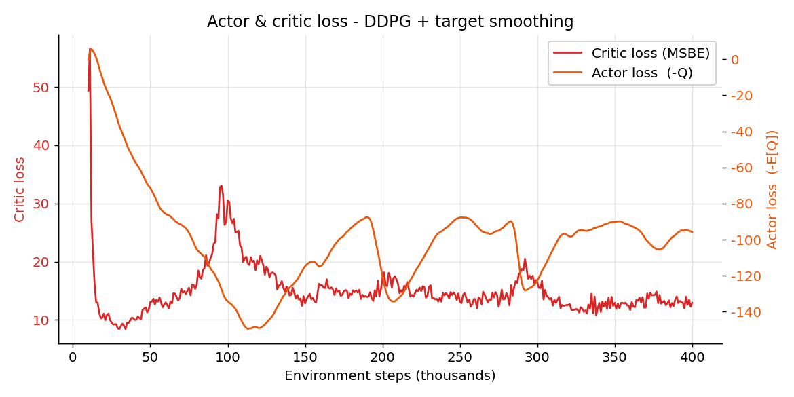
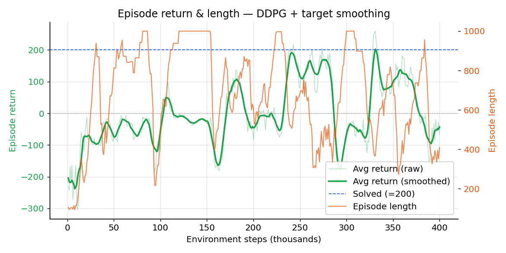

<p align="center">
  
</p>

<p align="center">
  
</p>

<p align="center">
  <em>The tuned DDPG policy landing on <code>LunarLanderContinuous-v3</code> (deterministic eval: 213 ± 86 mean return, 83% of episodes solved).</em>
</p>

# Deep Deterministic Policy Gradient (DDPG)

## Overview
DDPG is an off-policy actor-critic method for continuous action spaces that maintains deterministic policies. This implementation mirrors the structure of the other agents in this repository (PPO, SAC, TD3, etc.) with configurable components, shared utilities, and consistent logging.

## Highlights
- Deterministic actor network with a single critic and Polyak-averaged targets.
- Replay buffer warm-up, optional target policy smoothing, and Gaussian exploration noise.
- Integrated tqdm-aware logging, checkpoint helpers, and Weights & Biases tracking.

## What is DDPG?
DDPG (Lillicrap et al., 2016) is an **off-policy, actor–critic** algorithm for environments with **continuous** action spaces. It blends two ideas:

- **Deterministic Policy Gradient (DPG):** instead of a stochastic policy that outputs a *distribution* over actions, DDPG learns a **deterministic** actor $\mu_\theta(s)$ that outputs one specific action. This lets us push gradients of the value estimate *directly through the chosen action* — cheap and low-variance in high-dimensional continuous control.
- **DQN-style stabilization:** like DQN, it uses an **experience replay buffer** (to decorrelate samples and reuse off-policy data) and **target networks** (slowly tracking copies that stabilize the bootstrapped learning target).

The result is an actor–critic pair:

- **Critic** $Q_\phi(s, a)$ — learns the action-value function (how good is action $a$ in state $s$).
- **Actor** $\mu_\theta(s)$ — learns to output the action that *maximizes* the critic.

Because the policy is deterministic, exploration must be injected by hand: at acting time we add noise to the action (this implementation uses Gaussian noise; the original paper used Ornstein–Uhlenbeck).

### How a single step works
1. Observe $s$, act with $a = \mathrm{clip}\big(\mu_\theta(s) + \epsilon,\ a_{\text{low}},\ a_{\text{high}}\big)$, where $\epsilon \sim \mathcal{N}(0, \sigma^2)$.
2. Store the transition $(s, a, r, s', d)$ in the replay buffer.
3. Sample a random minibatch and update the critic (regression toward a bootstrapped target), then the actor (gradient ascent on the critic), then softly nudge both target networks.

## The Math Behind DDPG

**Objective.** We want a policy that maximizes the expected discounted return. For a deterministic policy $\mu_\theta$ this is

$$
J(\theta) = \mathbb{E}_{s \sim \rho^\beta}\big[\, Q^{\mu}(s, \mu_\theta(s)) \,\big],
$$

where $\rho^\beta$ is the state distribution induced by the (noisy) behaviour policy $\beta$ — i.e. the states sitting in the replay buffer.

**Critic learning (Bellman / TD target).** The critic is trained to satisfy the Bellman equation. Using target networks $\mu_{\theta'}$ and $Q_{\phi'}$, we form the one-step target

$$
y = r + \gamma\,(1 - d)\, Q_{\phi'}\big(s',\, \mu_{\theta'}(s')\big),
$$

where $\gamma \in (0, 1]$ is the discount factor and $d \in \{0, 1\}$ flags a terminal transition (so no bootstrap past episode end). The critic minimizes the **mean-squared Bellman error** over a minibatch $\mathcal{B}$ drawn from the replay buffer $\mathcal{D}$:

$$
L(\phi) = \mathbb{E}_{(s,a,r,s',d) \sim \mathcal{B}}\Big[\big(Q_\phi(s, a) - y\big)^2\Big].
$$

**Actor learning (Deterministic Policy Gradient theorem).** The actor is updated to produce actions that the critic rates highly. The DPG theorem gives the gradient of $J$ via the chain rule through the action:

$$
\nabla_\theta J(\theta) = \mathbb{E}_{s \sim \mathcal{B}}\Big[\, \nabla_a Q_\phi(s, a)\big|_{a = \mu_\theta(s)} \; \nabla_\theta \mu_\theta(s) \,\Big].
$$

In practice this is implemented as **gradient descent** on the actor loss (the negative of the above objective):

$$
L(\theta) = -\,\mathbb{E}_{s \sim \mathcal{B}}\big[\, Q_\phi(s, \mu_\theta(s)) \,\big].
$$

**Target network soft (Polyak) updates.** After each gradient step, the target networks are nudged a tiny fraction $\tau \ll 1$ toward the live networks, which keeps the regression target $y$ slow-moving and stable:

$$
\phi' \leftarrow \tau\,\phi + (1 - \tau)\,\phi', \qquad
\theta' \leftarrow \tau\,\theta + (1 - \tau)\,\theta'.
$$

**Bounded actions.** The actor squashes its output through $\tanh$ and rescales to the environment's action range, so every emitted action is valid by construction:

$$
\mu_\theta(s) = a_{\text{bias}} + a_{\text{scale}} \cdot \tanh\big(f_\theta(s)\big),
\quad
a_{\text{scale}} = \frac{a_{\text{high}} - a_{\text{low}}}{2},
\quad
a_{\text{bias}} = \frac{a_{\text{high}} + a_{\text{low}}}{2}.
$$

**Optional target-policy smoothing.** This implementation also exposes a TD3-style trick (off by default): adding clipped noise to the *target* action $\mu_{\theta'}(s')$ before evaluating $Q_{\phi'}$, which regularizes sharp peaks in the critic:

$$
\tilde a' = \mathrm{clip}\Big(\mu_{\theta'}(s') + \mathrm{clip}(\epsilon, -c, c),\ a_{\text{low}},\ a_{\text{high}}\Big),
\quad \epsilon \sim \mathcal{N}(0, \tilde\sigma^2).
$$

### Algorithm summary
1. Initialize critic $Q_\phi$, actor $\mu_\theta$, and targets $\phi' \leftarrow \phi$, $\theta' \leftarrow \theta$; empty replay buffer $\mathcal{D}$.
2. For each environment step: select $a = \mathrm{clip}(\mu_\theta(s) + \epsilon, a_{\text{low}}, a_{\text{high}})$, execute it, store $(s, a, r, s', d)$ in $\mathcal{D}$.
3. Sample a minibatch from $\mathcal{D}$; compute target $y$; update the critic by minimizing $L(\phi)$.
4. Update the actor by ascending the deterministic policy gradient (minimizing $L(\theta)$).
5. Soft-update both target networks with $\tau$.

### Symbol → code map
| Symbol | Meaning | Where in code |
| --- | --- | --- |
| $\mu_\theta$, $\mu_{\theta'}$ | actor and target actor | `Actor` in `ddpg/networks.py`; `agent.actor`, `agent.actor_target` |
| $Q_\phi$, $Q_{\phi'}$ | critic and target critic | `Critic` in `ddpg/networks.py`; `agent.critic`, `agent.critic_target` |
| $y$ | Bellman target | `target` in `DDPGAgent.update` |
| $L(\phi)$ | critic MSBE loss | `critic_loss` (F.mse_loss) |
| $L(\theta)$ | actor loss $-Q(s,\mu(s))$ | `actor_loss` |
| $\gamma$ | discount factor | `gamma` |
| $\tau$ | Polyak coefficient | `tau` (`_soft_update`) |
| $\sigma$ | exploration noise std | `exploration_noise` |
| $\tilde\sigma$, $c$ | target smoothing std / clip | `target_policy_noise`, `target_noise_clip` |
| $a_{\text{scale}}$, $a_{\text{bias}}$ | action rescaling | `action_scale`, `action_bias` buffers in `Actor` |

## Environment
The default benchmark is **`LunarLanderContinuous-v3`** — a continuous-control rocket-landing task whose two-dimensional action space (main and side thrusters) and dense shaping reward are a natural fit for DDPG's deterministic actor. It reliably converges to a successful-landing policy, making for a clean visual inference demo. `Pendulum-v1` is kept as an alternative config.

## Quickstart
```bash
# ==================================================
# Recommended: the tuned config (target smoothing) reproduces the demo above
python -m DDPG.main train --config DDPG/configs/lunarlander_continuous_tuned.yaml

python -m DDPG.main demo --config DDPG/configs/lunarlander_continuous_tuned.yaml --model_path DDPG/checkpoints_tuned/best.pt

# ==================================================
# Or, for the pure DDPG config (no target smoothing)
python -m DDPG.main train --config DDPG/configs/lunarlander_continuous.yaml

python -m DDPG.main demo --config DDPG/configs/lunarlander_continuous.yaml --model_path DDPG/checkpoints/best.pt
```
Authenticate with WandB via `--wandb_key YOUR_KEY`, or export `WANDB_API_KEY` in your environment (the CLI flag takes precedence) — matching the PPO / SAC / TD3 / A3C convention. Checkpoints and the moving-average `best.pt` snapshot are written under the config's `checkpoint_dir`. **Always demo from `best.pt`, not the last checkpoint** — see [Training results & analysis](#training-results--analysis) for why.

### Running with uv
If you manage the project with [uv](https://github.com/astral-sh/uv), set up the environment once from the repository root:

```bash
uv venv .venv          # create the virtual environment
uv sync                # install the core dependencies from pyproject.toml
```

**Box2D is required for the default environment.** `LunarLanderContinuous-v3` runs on Box2D, which is *not* part of the default `pyproject.toml` extras (`classic-control`, `toy-text`). Add it once:

```bash
uv pip install "gymnasium[box2d]"
# if the box2d build fails, install SWIG first, then retry:
#   uv pip install swig && uv pip install "gymnasium[box2d]"
```

Then run training and the demo through `uv run` (no manual activation needed):

```bash
uv run python -m DDPG.main train --config DDPG/configs/lunarlander_continuous.yaml
uv run python -m DDPG.main demo  --config DDPG/configs/lunarlander_continuous.yaml --model_path DDPG/checkpoints/best.pt
```

The `Pendulum-v1` config needs no extra dependencies (`classic-control` is already included), so it works right after `uv sync`.

## Tests
```bash
# from the repo root (conda env rlhero, or any env with the deps installed)
python -m pytest tests/ddpg/

# or with uv
uv run python -m pytest tests/ddpg/
```
The DDPG tests use stubbed environments, so they run without Box2D installed.

## Configuration
YAML files in `DDPG/configs/` expose hyper-parameters:
- **Environment**: Gym id, render mode, and optional kwargs.
- **Training**: interaction horizon, warm-up steps, replay buffer size, learning rates, Polyak factor, exploration noise, and optional target policy noise.
- **Model**: shared hidden layer sizes and activation for actor and critic.
- **Logging**: logging cadence, checkpoint cadence, output paths, and logger behaviour.
- **Inference**: default checkpoint path and number of evaluation episodes.

Two LunarLanderContinuous configs are provided:
- **`lunarlander_continuous.yaml`** — pure DDPG (no target smoothing). Useful for *seeing* the classic over-estimation failure (see below).
- **`lunarlander_continuous_tuned.yaml`** — adds TD3-style target-policy smoothing (`target_policy_noise=0.2`, `target_noise_clip=0.5`) and a gentler critic LR (`3e-4`). This is the config used for the demo above.

Copy either (or `pendulum.yaml`) to tailor runs for other continuous control benchmarks.

## Training results & analysis
Both configs were trained for **400k environment steps** on `LunarLanderContinuous-v3` (seed 42). The headline is a textbook illustration of why DDPG is famously unstable — and how target smoothing helps.

| Run | Best 5-ep avg (train) | Deterministic eval (30 ep) | % solved (≥200) | Peak critic Q | Peak critic loss |
|---|---|---|---|---|---|
| Pure DDPG | 187.9 | **55 ± 115** | 20% | **330** | **258** |
| DDPG + target smoothing | 259.7 | **213 ± 86** | **83%** | 147 | ~30 |

**What happened with pure DDPG.** The policy learned to land within the first ~20k steps (its peak), then **collapsed**: the single critic's Q-value exploded to ~330 while realized returns stayed *negative* (a ~240-point over-estimation gap). The actor maximizes the critic, so once the critic became delusional the policy chased a fiction and degraded — ending up hovering until the 1000-step timeout rather than committing to a landing. This is exactly the over-estimation pathology that motivated TD3.

**What the tuned run fixed.** Adding clipped noise to the target action ($\tilde a' = \mathrm{clip}(\mu_{\theta'}(s') + \mathrm{clip}(\epsilon,-c,c),\,a_{\text{low}},a_{\text{high}})$) and lowering the critic learning rate kept the Q-estimate calibrated (peak ~147, critic loss ~30 instead of 258). The result is a genuinely **solved** policy: 213 mean return with 83% of evaluation episodes ≥200.

> **Even when tuned, DDPG remains high-variance**; the return curve still oscillates and the *final* checkpoint (step 400k) evaluates at only −40. The strong policy lives in `best.pt`, which is why `save_best` (rolling-average checkpointing) is essential for this algorithm. Always demo from `best.pt`, not the last checkpoint.

### Training charts
Charts below are from the tuned run (`DDPG/configs/lunarlander_continuous_tuned.yaml`).

<p align="center">
  
</p>

*Critic Q-value (blue) vs. realized return (green). The estimate stays bounded (~147) and tracks real returns — contrast with pure DDPG, where Q ran away to ~330 while returns stayed negative.*

<p align="center">
  
</p>

*Actor loss ($-\mathbb{E}[Q]$) and critic loss (MSBE). The critic loss stays low and spike-free, a sign the bootstrapped target is well-behaved.*

<p align="center">
  
</p>

*Episode return (green) and length (orange). Returns repeatedly reach the solved bar (200), though with the high variance characteristic of DDPG.*

## References
- Lillicrap et al., Continuous Control with Deep Reinforcement Learning, ICLR 2016 https://arxiv.org/abs/1509.02971
- OpenAI Spinning Up DDPG: https://spinningup.openai.com/en/latest/algorithms/ddpg.html
- Stable-Baselines3 DDPG: https://stable-baselines3.readthedocs.io/en/master/modules/ddpg.html
