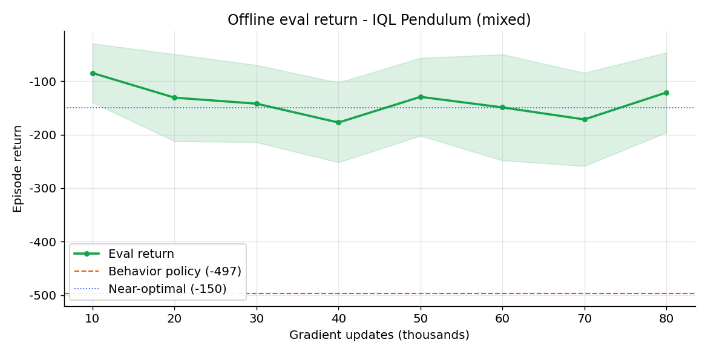
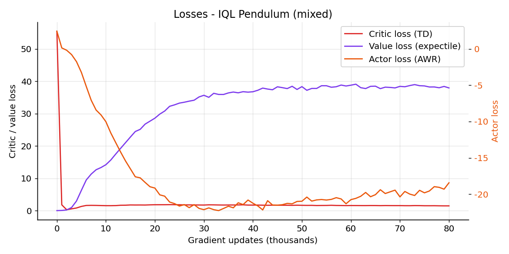
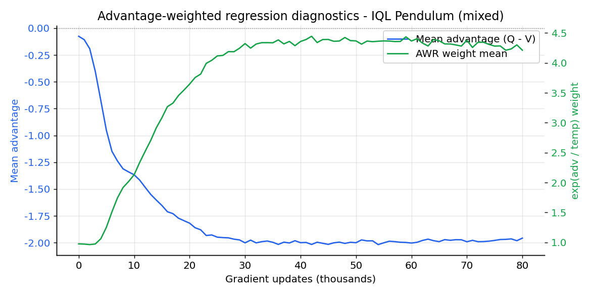

<p align="center">
  
</p>

<p align="center">
  
</p>

<p align="center">
  <em>IQL balancing <code>Pendulum-v1</code> from a fixed offline dataset (deterministic eval: -142 mean return, learned from behavior data worth only -497).</em>
</p>

# Implicit Q-Learning (IQL)

## Overview
IQL is an **offline** reinforcement learning algorithm: it learns entirely from a
fixed, previously collected dataset and never interacts with the environment
during training (the env is used only for periodic evaluation). It avoids
querying out-of-distribution actions by learning a value function with
**expectile regression**, training critics against that value target, and
extracting a policy with **advantage-weighted regression (AWR)**. This
implementation follows the shared layout used across the repo (PPO, SAC, TD3,
etc.) with modular configs, reusable utilities, tqdm-aware logging, and W&B.

## Highlights
- Twin Q critics with a soft-updated value target and configurable expectile, temperature, and weight clipping.
- Offline dataset loader with four sources: `random`, a self-contained `mixed` (medium) behavior dataset, `npz`, and `d4rl`.
- AWR actor extraction with a tanh-squashed Gaussian policy that respects action bounds.
- Checkpoint helpers, deterministic evaluation, and demo entrypoints consistent with the other agents.

## What is IQL?
Offline RL has one core difficulty: you cannot try new actions, so any value
estimate for an action the dataset never took can be wrong and overoptimistic,
and a naive actor will chase that error. IQL sidesteps this by **never evaluating
the Q-function on out-of-distribution actions during the value update**.

- **Value function** $V_\psi(s)$ learns an upper expectile of the dataset Q-values, approximating $\max_a Q$ but only over actions that actually appear in the data.
- **Critics** $Q_{\theta_1}, Q_{\theta_2}$ regress to the usual TD target built from $V_\psi(s')$ (no actor query, no max over actions).
- **Actor** $\pi_\phi$ is extracted by advantage-weighted regression: behavior-clone the dataset actions, but weight each by $\exp(\beta (Q - V))$ so good actions are copied more strongly.

The result is a policy that can be substantially better than the behavior policy
that produced the data, without ever overestimating unseen actions.

## The Math Behind IQL

**Expectile value loss.** $V_\psi$ is fit to an upper expectile $\tau \in (0.5, 1)$ of the target-Q distribution using the asymmetric squared loss $L_2^\tau$:

$$
L_V(\psi) = \mathbb{E}_{(s,a) \sim \mathcal{D}}\Big[ L_2^\tau\big( Q_{\bar\theta}(s, a) - V_\psi(s) \big) \Big],
\qquad
L_2^\tau(u) = \lvert\, \tau - \mathbb{1}(u < 0)\,\rvert \; u^2 .
$$

For $\tau > 0.5$ positive residuals (where $Q > V$) are weighted more, so $V_\psi$ approaches the in-distribution maximum of $Q$ rather than its mean.

**Critic (TD) loss.** The critics regress to a target built from the value network, so no out-of-distribution action is ever queried:

$$
L_Q(\theta_i) = \mathbb{E}_{(s,a,r,s',d) \sim \mathcal{D}}\Big[ \big( r + \gamma\,(1 - d)\, V_{\psi}(s') - Q_{\theta_i}(s, a) \big)^2 \Big],
\quad i \in \{1, 2\}.
$$

The value loss uses $\min(Q_{\theta_1}, Q_{\theta_2})$ as its target to reduce overestimation, and a Polyak-averaged value target $V_{\bar\psi}$ stabilizes the TD target.

**Policy extraction (AWR).** The actor maximizes the advantage-weighted log-likelihood of the dataset actions:

$$
L_\pi(\phi) = -\,\mathbb{E}_{(s,a) \sim \mathcal{D}}\Big[ \exp\!\big( \beta \,( Q_{\bar\theta}(s,a) - V_\psi(s) ) \big)\; \log \pi_\phi(a \mid s) \Big],
$$

with the weight clipped to `max_weight` for stability. $\beta$ is the inverse temperature: larger $\beta$ copies high-advantage actions more aggressively (closer to the greedy policy), smaller $\beta$ stays closer to plain behavior cloning.

### Algorithm summary
1. Collect (or load) a fixed dataset $\mathcal{D}$. No further environment interaction during training.
2. Update critics $Q_{\theta_i}$ toward $r + \gamma (1-d) V_{\bar\psi}(s')$.
3. Update $V_\psi$ by expectile regression toward $\min_i Q_{\theta_i}(s,a)$; soft-update $V_{\bar\psi}$.
4. Update the actor by AWR using advantages $\min_i Q_{\theta_i}(s,a) - V_\psi(s)$.
5. Periodically evaluate the deterministic policy in the env. Repeat.

### Symbol to code map
| Symbol | Meaning | Where in code |
| --- | --- | --- |
| $V_\psi$, $V_{\bar\psi}$ | value net and soft target | `ValueNetwork`; `agent.value`, `agent.value_target` |
| $Q_{\theta_1}, Q_{\theta_2}$ | twin critics | `QNetwork`; `agent.q1`, `agent.q2` |
| $\pi_\phi$ | AWR actor | `GaussianPolicy`; `agent.actor` |
| $L_2^\tau$ | expectile loss | `_expectile_loss` in `iql/agent.py` |
| $\tau$ | expectile | `expectile` |
| $\beta$ | inverse temperature | `temperature` |
| weight clip | AWR weight cap | `max_weight` |
| $\mathcal{D}$ | offline dataset | `OfflineDataset` / `build_dataset` in `iql/dataset.py` |

## Environment and datasets
IQL is continuous-only and is trained here on **`Pendulum-v1`** in a purely
offline setting (distinct from SAC's online Pendulum: IQL never steps the env
during training). The interesting axis for offline RL is the dataset, so two
self-contained regimes are provided:

- **`mixed`** (showcase) - a medium-quality dataset from a noisy energy-shaping
  swing-up controller mixed with random episodes (behavior return ~ -497).
- **`random`** - transitions from a uniform-random policy (behavior return ~ -1200).

The loader also supports `npz` (a saved `observations/actions/rewards/next_observations/terminals` archive) and `d4rl` (needs the `d4rl` package). Reward scale/shift/normalization are available for standard offline preprocessing.

## Quickstart
```bash
# Showcase: medium ("mixed") offline dataset
python -m IQL.main train --config IQL/configs/pendulum_mixed.yaml
python -m IQL.main demo  --config IQL/configs/pendulum_mixed.yaml --model_path IQL/checkpoints_mixed/best.pt

# Comparison: random offline dataset
python -m IQL.main train --config IQL/configs/pendulum_random.yaml
python -m IQL.main demo  --config IQL/configs/pendulum_random.yaml --model_path IQL/checkpoints_random/best.pt
```
Authenticate with WandB via `--wandb_key YOUR_KEY`, or export `WANDB_API_KEY` in your environment (the CLI flag takes precedence) - matching the PPO / SAC / TD3 / A3C / DDPG / TRPO convention. **Always demo from `best.pt`**: offline RL can overfit the dataset and degrade late in training (see analysis below).

### Running with uv
```bash
uv venv .venv
uv sync
uv run python -m IQL.main train --config IQL/configs/pendulum_mixed.yaml
```

## Tests
```bash
# from the repo root (conda env rlhero, or any env with the deps installed)
python -m pytest tests/iql/

# or with uv
uv run python -m pytest tests/iql/
```
The tests use stubs (no real training) and cover the networks, the agent update (expectile loss, AWR weight clipping, soft target move, state-dict round-trip), the offline dataset (random/mixed/npz sources), and the train/demo loops including the WandB key fallback and override.

## Configuration
YAML files in `IQL/configs/` expose the knobs:
- **Environment**: `env_id`, render mode, kwargs.
- **Dataset**: `dataset_source` (`random`/`mixed`/`npz`/`d4rl`), collection horizon, reward transforms.
- **Training**: gradient updates, batch size, `expectile`, `temperature` (beta), `max_weight`, gamma, tau, optimizer LRs.
- **Model**: shared hidden sizes and activation for actor, critics, and value net.
- **Logging / Inference**: log + eval cadence, checkpoint dir, eval episodes, `inference_model_path`.

## Training results & analysis
Both regimes trained for 80k gradient updates on a 60k-transition offline dataset (seed 42), evaluated in the env every 10k updates. The headline is the offline-RL value proposition: IQL extracts a near-optimal policy from clearly suboptimal data.

| Dataset | Behavior return | IQL best.pt (eval, 30 ep) | Peak eval (train) |
| --- | --- | --- | --- |
| mixed (medium) | ~ -497 | **-142 +/- 65** | -84.8 |
| random | ~ -1200 | **-177 +/- 99** | -97.6 |

(Near-optimal Pendulum is roughly -150; a perfectly upright start scores near 0.)

**IQL improves massively over the behavior policy.** From the mixed dataset, whose behavior controller averages only -497, IQL extracts a policy that evaluates at -142 (a ~3.5x improvement) and produces near-perfect balancing episodes. From purely random data (-1200) it still reaches -177. The mixed dataset gives the stronger, lower-variance policy, exactly as expected when the offline data has better coverage of good actions.

**Offline overfitting is real - use `best.pt`.** Both runs peak early (around 10k updates) and then *degrade* (random: -97.6 at 10k drifting to -207 by 60k). This is a known offline-RL effect: with a fixed dataset the value estimates slowly drift and the policy chases them. `save_best` (evaluation-gated checkpointing) captures the good early policy, which is why the demo and the eval numbers above use `best.pt`, not the last checkpoint.

### Training charts
Charts below are from the mixed (showcase) run.

<p align="center">
  
</p>

*Evaluation return vs. gradient updates, with the behavior-policy and near-optimal reference lines. IQL jumps well above the behavior return early, then drifts down (offline overfitting), so `best.pt` is taken at the peak.*

<p align="center">
  
</p>

*Critic (TD), value (expectile), and actor (AWR) losses.*

<p align="center">
  
</p>

*AWR diagnostics: the mean advantage (Q - V) and the mean exp(adv / temperature) weight that re-weights behavior cloning toward high-advantage actions.*

## References
- Kostrikov et al., Offline Reinforcement Learning with Implicit Q-Learning, NeurIPS 2021. https://arxiv.org/abs/2110.06169
- Reference implementation (Ilya Kostrikov): https://github.com/ikostrikov/implicit_q_learning
- Peng et al., Advantage-Weighted Regression, 2019. https://arxiv.org/abs/1910.00177
- Fu et al., D4RL: Datasets for Deep Data-Driven Reinforcement Learning, 2020. https://arxiv.org/abs/2004.07219
