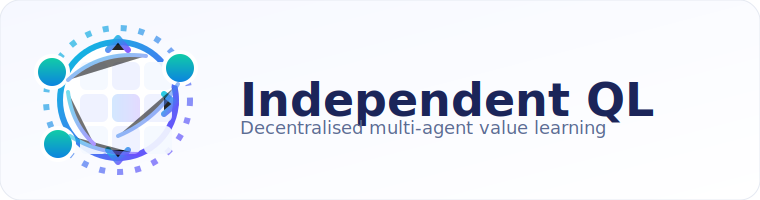

<p align="center">
  
</p>

# Independent Q-Learning (Multi-Agent)

This implementation extends the single-agent Q-learning scaffolding in the repo to a decentralised multi-agent formulation where each agent maintains an independent Q-table and treats the rest of the team as part of the environment dynamics.

## Highlights
- Two-player cooperative **LineWorld** environment tailored for tabular multi-agent experiments.
- Independent Q-learning agents with per-agent epsilon-greedy exploration and shared logging to Weights & Biases.
- YAML-first configuration (`Independent-QL/configs/line_world.yaml`) and consistent checkpointing interface with other algorithms in the project.
- CLI entry points for training and deterministic evaluation via the `demo` command.

## Usage
```bash
# Train (tabular independent Q-learning on LineWorld)
python Independent-QL/main.py train --config Independent-QL/configs/line_world.yaml

# Evaluate a saved model (greedy policies)
python Independent-QL/main.py demo --config Independent-QL/configs/line_world.yaml --model_path Independent-QL/checkpoints/best.pt
```

## Default Environment: LineWorld
- Linear grid with configurable length and number of agents (default: 2 agents on length 7).
- Individual goals near the right boundary, step penalties to promote efficiency, and collision penalties to foster coordination.
- Shared bonus when every agent reaches its goal in the same episode.

## Customization
- Adjust `env_kwargs` in the YAML config to change grid length, number of agents, rewards, or penalties.
- Tune learning hyperparameters (`alpha`, `gamma`, `epsilon_*`) directly in the same config.
- Checkpoints store the full stack of agent Q-tables as a tensor for easy inspection or warm-starting.

## Notes
- Implementation relies only on the repos existing dependencies (`gym`, `numpy`, `torch`, `tqdm`, `wandb`)—no extra packages required.
- Episodes terminate when every agent reaches its respective goal or the step budget is exhausted.
- For more complex scenarios, implement a new environment under `independent_ql/envs/` and reference it via `env_id` in the config.

## References
- Tan, M. (1993). *Multi-Agent Reinforcement Learning: Independent vs. Cooperative Agents.* Proceedings of the Tenth International Conference on Machine Learning, 330-337.
- Littman, M. (1994). *Markov Games as a Framework for Multi-Agent Reinforcement Learning.* Proceedings of the Eleventh International Conference on Machine Learning, 157-163.
- Foerster, J., Nardelli, N., Farquhar, G., Torr, P., Kohli, P., & Whiteson, S. (2017). *Stabilising Experience Replay for Deep Multi-Agent Reinforcement Learning.* In ICML.
- Lowe, R., Wu, Y., Tamar, A., Harb, J., Abbeel, P., & Mordatch, I. (2017). *Multi-Agent Actor-Critic for Mixed Cooperative-Competitive Environments.* In NIPS.
