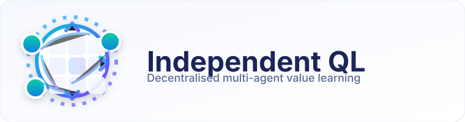
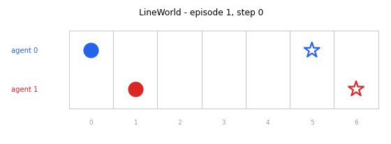
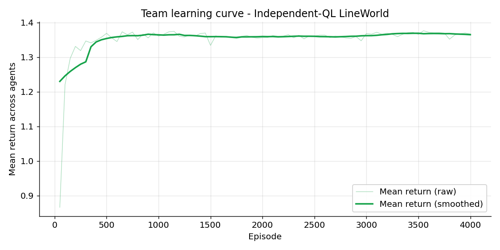
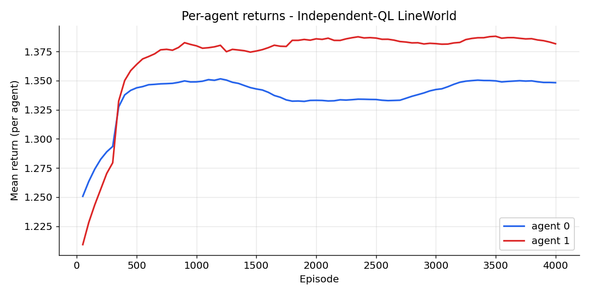
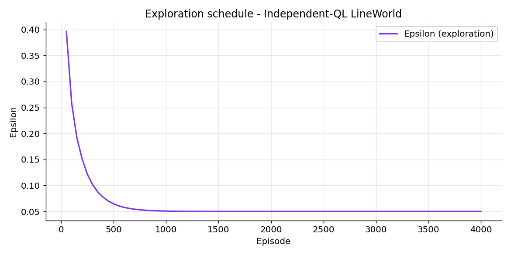

<p align="center">
  
</p>

<p align="center">
  
</p>

<p align="center">
  <em>Two independent Q-learners coordinating on <code>LineWorld</code> (greedy eval: both agents reach their goals in 20/20 episodes, ~7 steps).</em>
</p>

# Independent Q-Learning (Multi-Agent)

## Overview
Independent Q-Learning (IQL, Tan 1993) is the simplest multi-agent baseline: every
agent runs ordinary tabular Q-learning on its own, treating the other agents as
part of the environment. There is no communication, no shared value function, and
no centralized critic. This implementation pairs that idea with a small custom
cooperative grid, **LineWorld**, and follows the repo's shared layout (YAML
configs, checkpointing, tqdm logging, Weights & Biases).

## Highlights
- Per-agent independent Q-tables with epsilon-greedy exploration and a shared epsilon schedule.
- Custom cooperative **LineWorld** env (configurable agents, grid length, rewards) with a matplotlib renderer for demos.
- Joint-state observation: each agent sees every agent's position, which keeps its own learning problem closer to Markovian.
- Checkpointing, deterministic greedy evaluation, and a fire CLI consistent with the other agents.

## What is Independent Q-Learning?
In a multi-agent task the environment's transitions depend on *all* agents'
actions. Independent Q-Learning ignores that coupling: agent $i$ keeps its own
table $Q_i(s, a)$ and updates it with the standard single-agent rule, as if the
other agents were a fixed part of the world. It is appealing because it is trivial
to implement and scales linearly in the number of agents.

The catch is **nonstationarity**: while agent $i$ learns, the other agents are
also changing their policies, so the "environment" agent $i$ sees keeps shifting.
That breaks the convergence guarantees of single-agent Q-learning. In practice it
often still works on cooperative tasks (as here), but it can be unstable, and the
quality of the joint policy depends on the agents discovering compatible
behaviors. LineWorld gives each agent the full joint position as its state, which
softens the nonstationarity enough for reliable coordination.

## The Math Behind Independent Q-Learning

**Per-agent tabular update.** Each agent $i$ applies the standard Q-learning
update to its own table, using only its own reward $r_i$ and a bootstrap from its
own table at the next state:

$$
Q_i(s_i, a_i) \leftarrow Q_i(s_i, a_i) + \alpha \Big[ r_i + \gamma\,(1 - d_i)\, \max_{a'} Q_i(s_i', a') - Q_i(s_i, a_i) \Big].
$$

There is no coupling term between agents: the only place the others enter is
implicitly, through how they change $r_i$, $s_i'$, and the goal flag $d_i$.

**Exploration.** Each agent acts epsilon-greedily with a shared, exponentially
decayed schedule on the global step $t$:

$$
a_i = \begin{cases} \text{random action} & \text{with prob. } \epsilon(t) \\ \arg\max_a Q_i(s_i, a) & \text{otherwise} \end{cases},
\qquad
\epsilon(t) = \epsilon_{\text{end}} + (\epsilon_{\text{start}} - \epsilon_{\text{end}})\, e^{-\lambda t}.
$$

**Joint-state encoding.** LineWorld encodes each agent's observation from the full
vector of positions $(p_0, \dots, p_{N-1})$ (base-`grid_length` digits) plus the
agent index, so distinct agents index disjoint slices of their tables while still
conditioning on what everyone is doing.

### Algorithm summary
1. Reset; every agent observes the joint state.
2. Each agent picks an action epsilon-greedily from its own table.
3. Step the environment; each agent gets its own reward and next observation.
4. Each agent applies the tabular Q-update to its own table independently.
5. Repeat until all agents reach their goals or the step budget is hit.

### Symbol to code map
| Symbol | Meaning | Where in code |
| --- | --- | --- |
| $Q_i$ | per-agent Q-tables | `agent.Q` (shape `[n_agents, n_states, n_actions]`) |
| update | tabular Q-learning step | `IndependentQLearningAgent.update` |
| $\epsilon(t)$ | epsilon schedule | `IndependentQLearningAgent.epsilon` |
| $\alpha$, $\gamma$ | learning rate, discount | `alpha`, `gamma` |
| joint-state encoding | observation index | `LineWorldEnv._encode_state` |

## Environment: LineWorld
A one-dimensional cooperative grid (`independent_ql/envs/line_world.py`):
- `n_agents` agents (default 2) on a line of `grid_length` cells (default 7); actions are stay / right / left.
- Each agent has its own goal near the right edge; small step penalty, collision penalty for sharing a cell, and a shared bonus when *all* agents are on their goals.
- An agent that reaches its goal receives the goal reward once and then **freezes** there (it stops moving and stops earning), so a finished agent cannot farm reward while waiting for its teammate. The episode ends when all agents are done or the step budget is exhausted.

LineWorld is the shared testbed for the tabular multi-agent algorithms in this repo; Independent-QL uses the cooperative variant.

## Quickstart
The folder name is hyphenated, so run the script directly (not `python -m`):
```bash
python Independent-QL/main.py train --config Independent-QL/configs/line_world.yaml
python Independent-QL/main.py demo  --config Independent-QL/configs/line_world.yaml --model_path Independent-QL/checkpoints/best.pt
```
Authenticate with WandB via `--wandb_key YOUR_KEY`, or export `WANDB_API_KEY` in your environment (the CLI flag takes precedence) - matching the other agents. Checkpoints and the best-so-far `best.pt` are written under `Independent-QL/checkpoints/`.

### Running with uv
```bash
uv venv .venv
uv sync
uv run python Independent-QL/main.py train --config Independent-QL/configs/line_world.yaml
```

## Tests
```bash
# from the repo root (conda env rlhero, or any env with the deps installed)
python -m pytest tests/independentql/

# or with uv
uv run python -m pytest tests/independentql/
```
A `conftest.py` puts the `independent_ql` package on the path. The tests cover the LineWorld dynamics (movement, goals, freezing, collisions, truncation, render), the agent (epsilon decay, greedy argmax, terminal vs bootstrap updates), and the train/demo loops including the WandB key fallback and override.

## Configuration
`Independent-QL/configs/line_world.yaml` exposes:
- **Environment**: `env_id` and `env_kwargs` (agents, grid length, rewards, penalties).
- **Training**: total episodes, max steps per episode, `alpha`, `gamma`, and the epsilon schedule.
- **Logging / Inference**: log + checkpoint cadence, checkpoint dir, eval episodes.

## Training results & analysis
Trained for 4000 episodes (seed 42). Greedy (epsilon = 0) evaluation over 20 episodes:

| Metric | Value |
| --- | --- |
| Both agents reach goals | **20 / 20 episodes** |
| Steps to joint completion | ~7 (optimal is 5) |
| Mean return per agent | 1.38 (goal 1.0 + shared bonus 0.5 - step costs) |

The team learning curve climbs from ~0.9 to a ~1.37 plateau within a few hundred episodes and stays there: the two independent learners reliably coordinate to reach their goals.

**A metric gotcha worth knowing.** In an earlier version of the env, an agent that reached its goal kept *re-collecting* the goal reward every step while waiting for its teammate. That let a single agent camping on its goal inflate the mean-return metric, so `best.pt` (chosen by that metric) could be saved while the *other* agent had not actually learned to reach its goal - the greedy policy then solved 0/20. The fix was to make a reached goal grant its reward once and freeze the agent (see the env section), which makes the metric honest and `best.pt` genuinely best. This is a good reminder that in multi-agent RL a high team-average number can hide one agent free-riding.

### Training charts

<p align="center">
  
</p>

*Mean return across agents over episodes. It converges to ~1.37 (both agents reaching their goals plus the shared bonus).*

<p align="center">
  
</p>

*Per-agent returns. Both agents learn to reach their own goals; the curves tracking together is the signature of successful coordination (not one agent free-riding).*

<p align="center">
  
</p>

*The shared epsilon-greedy exploration schedule decaying from 1.0 toward its floor.*

## References
- Tan, M. (1993). Multi-Agent Reinforcement Learning: Independent vs. Cooperative Agents. ICML.
- Littman, M. (1994). Markov Games as a Framework for Multi-Agent Reinforcement Learning. ICML.
- Busoniu, Babuska, De Schutter (2008). A Comprehensive Survey of Multi-Agent Reinforcement Learning. IEEE Transactions on Systems, Man, and Cybernetics.
