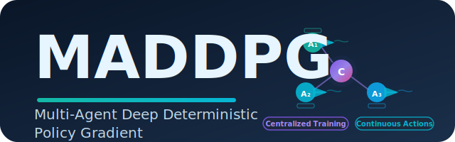

<p align="center">
  
</p>

# Multi-Agent Deep Deterministic Policy Gradient (MADDPG)

MADDPG is a multi-agent reinforcement learning algorithm that extends DDPG to cooperative and competitive multi-agent environments. It uses centralized training with decentralized execution (CTDE).

## Algorithm Overview

**Key Features:**
- **Centralized Training, Decentralized Execution**: Each agent's critic can observe all agents' observations and actions during training, but actors only use local observations during execution
- **Continuous Action Spaces**: Uses deterministic policy gradients for continuous control
- **Experience Replay**: Off-policy learning with replay buffer
- **Target Networks**: Soft target updates for stability (Polyak averaging)
- **Exploration**: Gaussian noise for exploration in continuous action spaces

**Architecture:**
- Each agent has its own **Actor** network (policy) that maps observations to actions
- Each agent has its own **Critic** network (Q-function) that takes all agents' observations and actions as input
- Target networks for both actor and critic with soft updates

## Environment

This implementation uses the **Simple Spread** environment from PettingZoo's Multi-agent Particle Environments (MPE):
- **Goal**: Multiple agents must cooperatively spread out to cover all landmarks
- **Observation**: Each agent observes its own position, velocity, and relative positions to landmarks and other agents
- **Action**: Continuous 2D movement (force applied in x and y directions)
- **Reward**: Negative sum of distances from agents to landmarks (cooperative reward)

## Usage

### Training

Train MADDPG on Simple Spread:

```bash
python -m MADDPG.main train
```

Train with custom config:

```bash
python -m MADDPG.main train --config=MADDPG/configs/simple_spread.yaml
```

Train with WandB logging:

```bash
python -m MADDPG.main train --wandb_key=YOUR_WANDB_KEY
```

### Inference

Run trained agents with visualization:

```bash
python -m MADDPG.main demo
```

Run with custom model checkpoint:

```bash
python -m MADDPG.main demo --model_path=MADDPG/checkpoints/best.pt --episodes=10
```

## Configuration

Key hyperparameters in `configs/simple_spread.yaml`:

- `total_steps`: 1,000,000 - Total training steps
- `start_steps`: 25,000 - Random exploration steps before training
- `batch_size`: 1024 - Batch size for updates
- `buffer_size`: 1,000,000 - Replay buffer capacity
- `gamma`: 0.95 - Discount factor
- `tau`: 0.01 - Soft update coefficient
- `actor_lr`: 0.01 - Actor learning rate
- `critic_lr`: 0.01 - Critic learning rate
- `exploration_noise`: 0.1 - Gaussian noise std for exploration
- `target_policy_noise`: 0.2 - Target policy smoothing noise
- `hidden_sizes`: [64, 64] - Network hidden layers

## Implementation Details

### File Structure

```
MADDPG/
├── maddpg/
│   ├── __init__.py
│   ├── agent.py           # MADDPGAgent with act() and update()
│   ├── config.py          # Configuration dataclass
│   ├── networks.py        # Actor and Critic networks
│   ├── replay_buffer.py   # Multi-agent replay buffer
│   ├── utils.py           # Environment setup and checkpointing
│   └── logging_utils.py   # Logger setup
├── configs/
│   └── simple_spread.yaml # Default configuration
├── checkpoints/           # Saved models
├── main.py                # Training and demo entry point
└── README.md              # This file
```

### Network Architecture

**Actor Network:**
- Input: Individual agent observation
- Hidden: [64, 64] with ReLU activation
- Output: Continuous action with tanh activation
- Action scaling: Maps [-1, 1] to action space bounds

**Critic Network:**
- Input: Concatenated observations and actions from all agents
- Hidden: [64, 64] with ReLU activation
- Output: Single Q-value

### Training Loop

1. **Data Collection**: Agents interact with environment using current policies with exploration noise
2. **Experience Replay**: Store transitions (obs, actions, rewards, next_obs, dones) for all agents
3. **Critic Update**: Minimize TD error using target Q-values from target networks
4. **Actor Update**: Maximize Q-value by gradient ascent on actor parameters
5. **Target Update**: Soft update of target networks using Polyak averaging

### Multi-Agent Considerations

- **Centralized Critic**: Each agent's critic observes the full state (all observations and actions)
- **Decentralized Actor**: Each agent's actor only uses its own observation for execution
- **Individual Rewards**: Each agent can have its own reward signal
- **Coordinated Learning**: All agents are updated simultaneously

## Algorithm Details

MADDPG update equations:

**Critic Loss:**
```
L = E[(Q_i(o, a) - y)^2]
where y = r_i + γ * Q'_i(o', μ'(o'))
```

**Actor Loss:**
```
∇_θ J = E[∇_θ μ_i(o_i) * ∇_a Q_i(o, a₁, ..., μ_i(o_i), ..., a_N)]
```

**Target Update:**
```
θ' ← τθ + (1-τ)θ'
```

Where:
- `Q_i`: Critic for agent i
- `μ_i`: Actor (policy) for agent i
- `o`: All agents' observations
- `a`: All agents' actions
- `τ`: Soft update coefficient

## References

- [Multi-Agent Actor-Critic for Mixed Cooperative-Competitive Environments (Lowe et al., 2017)](https://arxiv.org/abs/1706.02275)
- [DDPG: Continuous control with deep reinforcement learning (Lillicrap et al., 2015)](https://arxiv.org/abs/1509.02971)
- [PettingZoo: Gym for Multi-Agent Reinforcement Learning](https://pettingzoo.farama.org/)

## Expected Performance

On Simple Spread (3 agents, 3 landmarks):
- **Training Time**: ~1M steps (varies by hardware)
- **Convergence**: Agents should learn to spread out and cover landmarks efficiently
- **Reward**: Target reward around -10 to 0 (lower is better, 0 is optimal)

## Troubleshooting

**Import Errors:**
Make sure PettingZoo is installed:
```bash
pip install pettingzoo[mpe]
```

**CUDA Errors:**
Set device to CPU in config:
```yaml
device: "cpu"
```

**Slow Training:**
- Reduce `batch_size` to 512 or 256
- Reduce `updates_per_step` to 1
- Use GPU if available (set `device: "cuda"`)

**Poor Performance:**
- Increase `start_steps` for more exploration
- Tune learning rates (`actor_lr`, `critic_lr`)
- Adjust `exploration_noise` and `target_policy_noise`
- Try different network sizes in `hidden_sizes`
