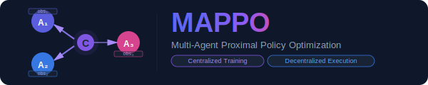
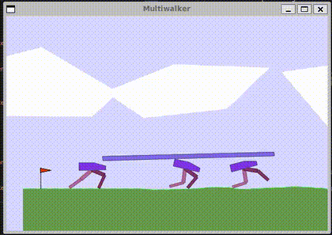
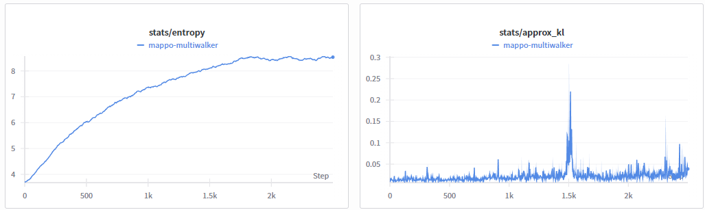
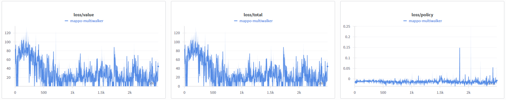
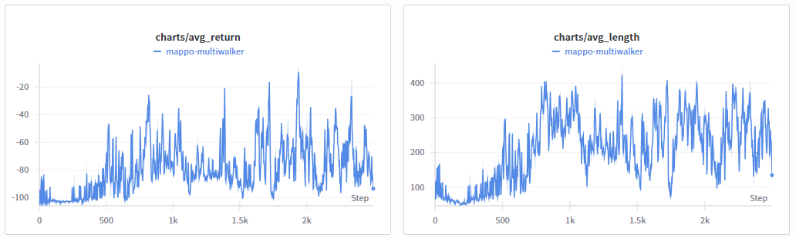

<p align="center">
  
</p>

# Multi-Agent Proximal Policy Optimization (MAPPO)

<p align="center">
  
</p>

MAPPO is a multi-agent reinforcement learning algorithm that extends PPO to cooperative multi-agent settings. It features decentralized actor policies with a centralized critic that has access to the full state information, enabling better coordination among agents while maintaining decentralized execution.

## Algorithm Overview

MAPPO combines the benefits of:
- **Centralized Training with Decentralized Execution (CTDE)**: During training, a centralized critic uses full state information to provide better value estimates, while actors only use local observations for decentralized execution
- **PPO's stable updates**: Clipped surrogate objective prevents destructive policy updates
- **Multi-agent coordination**: Agents learn to cooperate through shared reward signals and centralized value function

### Key Features
- **Decentralized actors**: Each agent has its own policy network that only observes local information
- **Centralized critic**: Value function uses concatenated observations from all agents (full state) for better credit assignment
- **Parameter sharing option**: Agents can optionally share the same policy network to improve sample efficiency
- **PPO clipping**: Both policy and value function use clipping for stable training
- **GAE for advantage estimation**: Generalized Advantage Estimation for low-variance policy gradients

## Highlights
- PettingZoo **MultiWalker-v9** environment as the default multi-agent testbed
- YAML-first configuration (`MAPPO/configs/multiwalker.yaml`) consistent with other algorithms in the project
- CLI entry points for training and evaluation via `demo` command
- Weights & Biases logging for training metrics
- Support for both shared and independent policies across agents
- Checkpoint saving with best model tracking

## Usage

```bash
# Train MAPPO agents on MultiWalker
python -m MAPPO.main train --config MAPPO/configs/multiwalker.yaml

# Evaluate a saved model with visualization
python -m MAPPO.main demo --config MAPPO/configs/multiwalker.yaml --model_path MAPPO/checkpoints/best.pt

# Train with Weights & Biases logging
python -m MAPPO.main train --config MAPPO/configs/multiwalker.yaml --wandb_key YOUR_KEY
```

Setup with uv:
```bash
# Create venv and install deps
uv venv .venv
uv pip install pettingzoo pygame torch numpy pyyaml tqdm wandb fire

# Train MAPPO on MultiWalker
uv run -m MAPPO.main train --config MAPPO/configs/multiwalker.yaml

# Demo a trained policy (renders a window)
uv run -m MAPPO.main demo --config MAPPO/configs/multiwalker.yaml --model_path MAPPO/checkpoints/best.pt --episodes 5
```

### Training charts

<p align="center">
  
</p>
<p align="center">
  
</p>
<p align="center">
  
</p>

## Default Environment: MultiWalker-v9

MultiWalker is a continuous control environment where multiple bipedal walkers must coordinate to carry a package across terrain:
- **Cooperative task**: All agents share the same reward and must work together
- **Partial observability**: Each agent observes its own state and package position
- **Challenging dynamics**: Agents must balance, walk, and coordinate without dropping the package
- **Termination conditions**: Episode ends if package is dropped or walkers fall

This environment tests MAPPO's ability to:
- Learn coordinated locomotion policies
- Handle continuous observation spaces
- Deal with agent removal (when walkers fall)
- Optimize shared rewards through centralized value functions

## Algorithm Details

### Architecture

**Actor (Policy) Network**:
- Input: Individual agent observation $o_i$
- Output: Action distribution $\pi_\theta(a_i | o_i)$
- Decentralized: Each agent acts based only on local observations

**Critic (Value) Network**:
- Input: Full state $s = [o_1, o_2, ..., o_n]$ (concatenated observations)
- Output: State value $V_\phi(s)$
- Centralized: Uses information from all agents during training

### Multi-Agent Objective (CTDE)

Let $N$ agents have local observations $o_t^i$, joint action $\mathbf{a}_t=(a_t^1,\dots,a_t^N)$, and centralized state $s_t=[o_t^1;\dots;o_t^N]$.

With decentralized actors, the joint policy factorizes as:

$$\pi_{\Theta}(\mathbf{a}_t \mid \mathbf{o}_t)=\prod_{i=1}^{N}\pi_{\theta_i}(a_t^i \mid o_t^i)$$

If policies are shared (`share_policy: true`), then $\theta_1=\cdots=\theta_N=\theta$.

For each agent:

$$r_t^i(\theta_i)=\frac{\pi_{\theta_i}(a_t^i \mid o_t^i)}{\pi_{\theta_i,\text{old}}(a_t^i \mid o_t^i)}$$

and the MAPPO actor objective aggregates clipped PPO objectives across agents:

$$L_{\text{actor}}(\Theta)=\frac{1}{N}\sum_{i=1}^{N}\mathbb{E}_t\left[\min\left(r_t^i\hat{A}_t^i,\ \text{clip}(r_t^i,1-\epsilon,1+\epsilon)\hat{A}_t^i\right)\right]$$

The centralized critic is trained from the global state:

$$L_{\text{value}}(\phi)=\mathbb{E}_t\left[\max\left((V_\phi(s_t)-R_t)^2,\ (V_\phi^{\text{clip}}(s_t)-R_t)^2\right)\right]$$

where:
- $V_\phi^{\text{clip}}(s_t)=V_{\phi,\text{old}}(s_t)+\text{clip}(V_\phi(s_t)-V_{\phi,\text{old}}(s_t),-\epsilon,\epsilon)$
- $R_t$ is the return target

Total loss in implementation form:

$$L_{\text{total}}=-L_{\text{actor}}+c_vL_{\text{value}}-c_e\frac{1}{N}\sum_{i=1}^{N}\mathbb{E}_t[\mathcal{H}(\pi_{\theta_i}(\cdot\mid o_t^i))]$$

### Advantage Estimation with Centralized Critic

For each agent $i$:

$$\delta_t^i=r_t^i+\gamma(1-d_t^i)V_\phi(s_{t+1})-V_\phi(s_t)$$

$$\hat{A}_t^i=\sum_{l=0}^{T-t-1}(\gamma\lambda)^l\delta_{t+l}^i,\quad R_t^i=\hat{A}_t^i+V_\phi(s_t)$$

The centralized baseline reduces non-stationarity because the critic conditions on all agents.

### Knowledge Sharing by Parameter Sharing

When policies are shared, MAPPO optimizes one parameter vector $\theta$ with a team-averaged gradient:

$$\nabla_\theta L_{\text{actor}}(\theta)=\frac{1}{N}\sum_{i=1}^{N}\mathbb{E}_t\left[\nabla_\theta \log \pi_\theta(a_t^i\mid o_t^i)\,\tilde{A}_t^i\right]$$

where $\tilde{A}_t^i$ denotes the clipped-importance-weighted advantage term. This is the explicit "knowledge sharing" mechanism in homogeneous-agent MAPPO.

### Convergence Notes (Practical, Not Global-Optimal Guarantees)

For deep multi-agent PPO, there is generally no theorem guaranteeing convergence to the globally best joint policy for all agents. In practice, convergence is improved when:
- policy updates remain small (monitor/limit KL),
- critic targets are stable (centralized value with correct terminal handling),
- gradients are clipped and learning rate is annealed,
- results are validated across multiple random seeds.

## Configuration Options

Key hyperparameters in `MAPPO/configs/multiwalker.yaml`:

### Multi-Agent Settings
- `n_agents`: Number of agents in the environment
- `share_policy`: Whether all agents share the same policy network
- `use_centralized_critic`: Use centralized critic with full state (recommended: true)

### Training Hyperparameters
- `total_timesteps`: Total environment steps for training
- `rollout_steps`: Steps collected before each policy update
- `update_iterations`: Number of epochs to optimize policy per update
- `minibatch_size`: Mini-batch size for SGD updates
- `learning_rate`: Learning rate for Adam optimizer
- `gamma`: Discount factor for future rewards
- `gae_lambda`: GAE lambda parameter for advantage estimation
- `clip_coef`: PPO clipping parameter
- `ent_coef`: Entropy bonus coefficient (encourages exploration)
- `vf_coef`: Value function loss coefficient
- `max_grad_norm`: Gradient clipping threshold
- `target_kl`: Early-stop threshold for PPO epochs
- `anneal_lr`: Whether to linearly anneal learning rate across updates

### Network Architecture
- `actor_hidden_sizes`: Hidden layer sizes for actor networks
- `critic_hidden_sizes`: Hidden layer sizes for critic network
- `activation`: Activation function ('relu' or 'tanh')

## Implementation Notes

- **Action spaces**: Supports discrete (Categorical) and continuous (tanh-squashed Gaussian) actions
- **Continuous observations**: Supports continuous observation spaces of any dimension
- **Agent removal**: Handles environments where agents can be removed (e.g., fallen walkers)
- **Shared rewards**: Optimized for cooperative tasks with shared reward structure
- **PettingZoo integration**: Uses PettingZoo's parallel API for multi-agent environments

## Comparison with Single-Agent PPO

| Aspect | PPO | MAPPO |
|--------|-----|-------|
| **Agents** | Single agent | Multiple agents |
| **Actor** | Uses full state | Uses local observations |
| **Critic** | Uses full state | Uses concatenated states (centralized) |
| **Action space** | Single action | Joint action (one per agent) |
| **Coordination** | N/A | Achieved via centralized critic |
| **Execution** | Centralized | Decentralized |

## Comparison with Independent PPO

| Aspect | Independent PPO | MAPPO |
|--------|----------------|-------|
| **Training** | Decentralized | Centralized training |
| **Critic** | Local observations | Full state (centralized) |
| **Credit assignment** | Difficult | Improved via centralized critic |
| **Non-stationarity** | Severe (each agent sees others as environment) | Reduced (critic aware of all agents) |
| **Sample efficiency** | Lower | Higher |
| **Convergence** | Less stable | More stable |

MAPPO addresses the non-stationarity problem of independent learning by using a centralized critic during training while maintaining decentralized execution.

## References

- **Yu, C., Velu, A., Vinitsky, E., Gao, J., Wang, Y., Bayen, A., & Wu, Y. (2022).** *The Surprising Effectiveness of PPO in Cooperative Multi-Agent Games.* Advances in Neural Information Processing Systems, 35, 24611-24624.
  - Empirical study showing MAPPO's effectiveness in cooperative multi-agent tasks

- **Schulman, J., Wolski, F., Dhariwal, P., Radford, A., & Klimov, O. (2017).** *Proximal Policy Optimization Algorithms.* arXiv preprint arXiv:1707.06347.
  - Original PPO paper that MAPPO is based on

- **Foerster, J., Farquhar, G., Afouras, T., Nardelli, N., & Whiteson, S. (2018).** *Counterfactual Multi-Agent Policy Gradients.* Proceedings of the AAAI Conference on Artificial Intelligence, 32(1).
  - Introduced centralized training with decentralized execution paradigm

- **Lowe, R., Wu, Y., Tamar, A., Harb, J., Abbeel, P., & Mordatch, I. (2017).** *Multi-Agent Actor-Critic for Mixed Cooperative-Competitive Environments.* Advances in Neural Information Processing Systems, 30.
  - MADDPG paper that introduced centralized critic for multi-agent RL

## Extensions and Future Work

1. **Continuous action improvements**: Tune action rescaling, entropy handling, or std schedules
   - Consider per-agent std bounds or adaptive exploration schedules

2. **Communication mechanisms**: Add inter-agent communication channels
   - Agents can share information beyond observations
   - Improves coordination in partially observable environments

3. **Attention mechanisms**: Use attention in centralized critic
   - Better scaling to variable numbers of agents
   - Improved credit assignment in large teams

4. **Competitive/mixed settings**: Extend to competitive or mixed cooperative-competitive scenarios
   - Separate value networks for different teams
   - Nash equilibrium concepts

5. **Recurrent policies**: Add LSTM/GRU for memory
   - Handle partial observability better
   - Maintain history of observations

6. **Imitation learning**: Bootstrap policies from expert demonstrations
   - Faster initial learning
   - Better final performance

## Troubleshooting

- **Agents not coordinating**: Enable centralized critic (`use_centralized_critic: true`) and shared policy (`share_policy: true`) for homogeneous teams
- **Training unstable**: Reduce `learning_rate`, lower `max_grad_norm`, and use `anneal_lr: true`
- **Slow convergence**: Increase `rollout_steps`, tune `ent_coef`, and verify GAE/terminal handling
- **High KL divergence warnings**: Lower `learning_rate` or `clip_coef`, and set a stricter `target_kl`
- **`ModuleNotFoundError: No module named 'Box2D'`**: Install the SISL extras or Box2D in your env:
  ```bash
  python -m pip install "pettingzoo[sisl]"
  # or, if pip fails on your Python version:
  conda install -c conda-forge box2d-py
  ```

## Environment Requirements

Install PettingZoo and dependencies:
```bash
pip install pettingzoo[sisl]
pip install pygame  # For rendering
```

The implementation has been tested with:
- PettingZoo >= 1.22.0
- PyTorch >= 2.0.0
- Python >= 3.8

## Notes

- This implementation follows the same structure as other algorithms in the RL-from-Zero repository
- Supports discrete and continuous action spaces (MultiWalker can run with continuous actions)
- Rendering requires pygame and works best with a local display
- For headless servers, set `render_mode: null` in config during training
- Checkpoints store all agent networks (or single shared network if `share_policy: true`)
