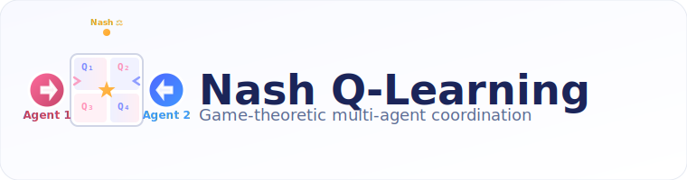

<p align="center">
  
</p>

# Nash Q-Learning (Multi-Agent)

Nash Q-learning is a multi-agent reinforcement learning algorithm that extends Q-learning to general-sum stochastic games. Unlike independent Q-learning where agents independently optimize their own Q-values, Nash Q-learning computes Nash equilibrium strategies at each state to achieve coordinated behavior.

## Algorithm Overview

In Nash Q-learning, each agent maintains Q-values over joint action spaces. At each state, agents solve for a Nash equilibrium of the stage game formed by their Q-values, and act according to the equilibrium mixed strategies. This enables agents to reason about strategic interactions and achieve better coordination in multi-agent settings.

### Key Features
- **Joint action Q-tables**: Each agent's Q-table stores values for all joint actions: `Q[agent][state][action_1][action_2]`
- **Nash equilibrium computation**: At each state, agents solve a bimatrix game to find Nash equilibrium strategies using linear programming
- **Coordinated exploration**: Agents explore using epsilon-Nash strategies (epsilon-greedy with Nash equilibrium for exploitation)
- **General-sum games**: Supports both cooperative and competitive multi-agent scenarios

## Highlights
- Two-player cooperative **LineWorld** environment for tabular multi-agent experiments
- Nash equilibrium solver using linear programming (scipy.optimize.linprog)
- YAML-first configuration (`Nash-QL/configs/line_world.yaml`) consistent with other algorithms in the project
- CLI entry points for training and deterministic evaluation via `demo` command
- Shared logging to Weights & Biases with per-agent metrics

## Usage

```bash
# Train Nash Q-learning agents on LineWorld
python -m Nash-QL.main train --config Nash-QL/configs/line_world.yaml

# Evaluate a saved model (Nash equilibrium policies)
python -m Nash-QL.main demo --config Nash-QL/configs/line_world.yaml --model_path Nash-QL/checkpoints/best.pt

# Train with Weights & Biases logging
python -m Nash-QL.main train --config Nash-QL/configs/line_world.yaml --wandb_key YOUR_KEY
```

## Default Environment: LineWorld

- Linear grid with configurable length and number of agents (default: 2 agents on length 7)
- Individual goals near the right boundary, step penalties to promote efficiency
- Collision penalties to foster coordination and avoid conflicts
- Shared bonus when every agent reaches its goal in the same episode

The LineWorld environment provides a simple testbed for multi-agent coordination where agents must navigate to their goals while avoiding collisions with each other.

## Algorithm Details

### Q-Value Update Rule

For each agent $i$ at state $s$ taking joint action $(a_1, a_2)$:

$$Q_i(s, a_1, a_2) \leftarrow Q_i(s, a_1, a_2) + \alpha \left[ r_i + \gamma V_i^{\text{Nash}}(s') - Q_i(s, a_1, a_2) \right]$$

where $V_i^{\text{Nash}}(s')$ is agent $i$'s expected value at state $s'$ under the Nash equilibrium:

$$V_i^{\text{Nash}}(s') = \sum_{a_1, a_2} \pi_1^*(a_1) \cdot \pi_2^*(a_2) \cdot Q_i(s', a_1, a_2)$$

### Nash Equilibrium Computation

At each state $s$, the Q-values form a bimatrix game:
- Agent 1's payoff matrix: $Q_1[s, :, :]$ (rows: agent 1's actions, columns: agent 2's actions)
- Agent 2's payoff matrix: $Q_2[s, :, :]$ (rows: agent 1's actions, columns: agent 2's actions)

We solve for a Nash equilibrium $(\pi_1^*, \pi_2^*)$ using linear programming. Each $\pi_i^*$ is a probability distribution over agent $i$'s actions.

### Action Selection

- **Exploration** (probability $\epsilon$): Sample actions uniformly at random
- **Exploitation** (probability $1 - \epsilon$):
  1. Compute Nash equilibrium $(\pi_1^*, \pi_2^*)$ for current state
  2. Sample actions according to equilibrium probabilities

## Customization

- Adjust `env_kwargs` in the YAML config to change grid length, number of agents, rewards, or penalties
- Tune learning hyperparameters (`alpha`, `gamma`, `epsilon_*`) directly in the same config
- Checkpoints store the full Q-tables as a 4D tensor: `[n_agents, n_states, n_actions, n_actions]`

## Implementation Notes

- Currently supports **2-player** games (extensible to n-players with minor modifications)
- Nash equilibrium solver uses scipy's linear programming (highs method)
- Implementation relies on the repo's existing dependencies (`numpy`, `torch`, `scipy`, `tqdm`, `wandb`)—no extra packages required
- Episodes terminate when every agent reaches its respective goal or the step budget is exhausted
- For more complex scenarios, implement a new environment under `nash_ql/envs/` and reference it via `env_id` in the config

## Comparison with Independent Q-Learning

| Aspect | Independent Q-Learning | Nash Q-Learning |
|--------|----------------------|-----------------|
| **Q-table structure** | `Q[agent][state][action]` | `Q[agent][state][action_1][action_2]` |
| **Action selection** | Greedy on own Q-values | Nash equilibrium of stage game |
| **Update target** | $\max_{a} Q_i(s', a)$ | $V_i^{\text{Nash}}(s')$ |
| **Convergence** | May fail in coordination games | Proven convergence to Nash equilibria |
| **Complexity** | $O(\|S\| \cdot \|A\|)$ per agent | $O(\|S\| \cdot \|A\|^n)$ for n agents |

Nash Q-learning requires more memory (joint action space) but can achieve better coordination in strategic multi-agent settings.

## References

- **Hu, J., & Wellman, M. P. (2003).** *Nash Q-learning for general-sum stochastic games.* Journal of machine learning research, 4(Nov), 1039-1069.
  - Original paper introducing Nash Q-learning

- **Littman, M. L. (1994).** *Markov games as a framework for multi-agent reinforcement learning.* Proceedings of the Eleventh International Conference on Machine Learning, 157-163.
  - Foundation for multi-agent RL using game theory

- **Busoniu, L., Babuska, R., & De Schutter, B. (2008).** *A comprehensive survey of multiagent reinforcement learning.* IEEE Transactions on Systems, Man, and Cybernetics, Part C (Applications and Reviews), 38(2), 156-172.
  - Comprehensive survey covering Nash Q-learning and related algorithms

- **Shoham, Y., Powers, R., & Grenager, T. (2003).** *Multi-agent reinforcement learning: a critical survey.* Technical report, Stanford University.
  - Critical analysis of multi-agent RL approaches including Nash Q-learning

## Limitations and Future Work

1. **Scalability**: Exponential growth in Q-table size with number of agents ($|A|^n$)
   - Future: Function approximation with deep networks (e.g., Deep Nash-Q)

2. **Multiple equilibria**: Games may have multiple Nash equilibria; solver returns one
   - Future: Equilibrium selection mechanisms or correlation devices

3. **Partial observability**: Current implementation assumes fully observable state
   - Future: Extend to Dec-POMDPs with belief-based representations

4. **Computational cost**: Solving Nash equilibrium at each step can be expensive
   - Future: Cached equilibria or approximate solvers for real-time applications

---

Happy experimenting with multi-agent coordination!
