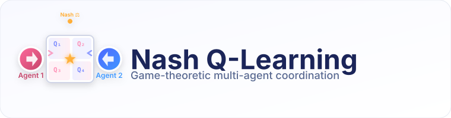
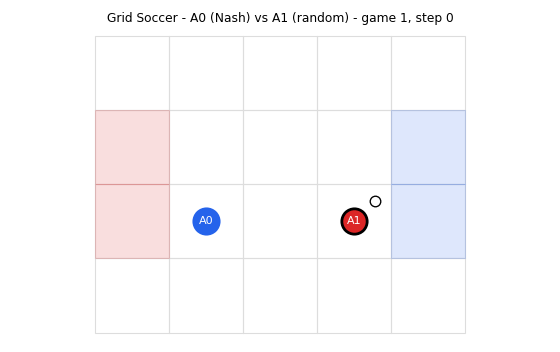
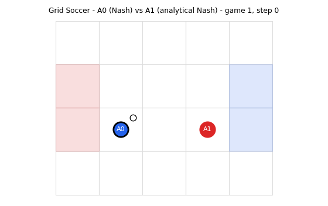
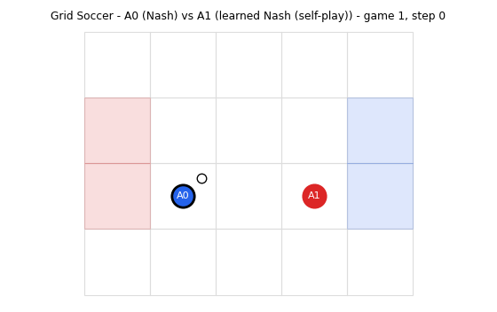
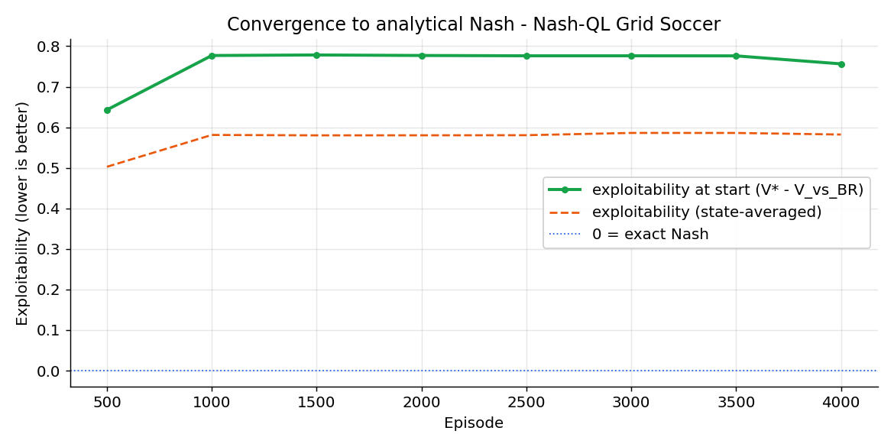
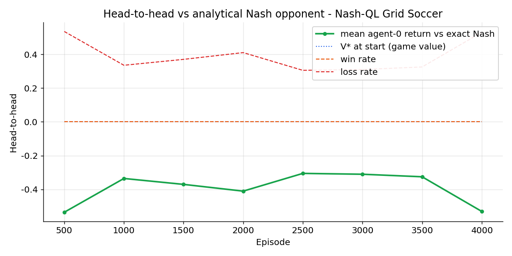
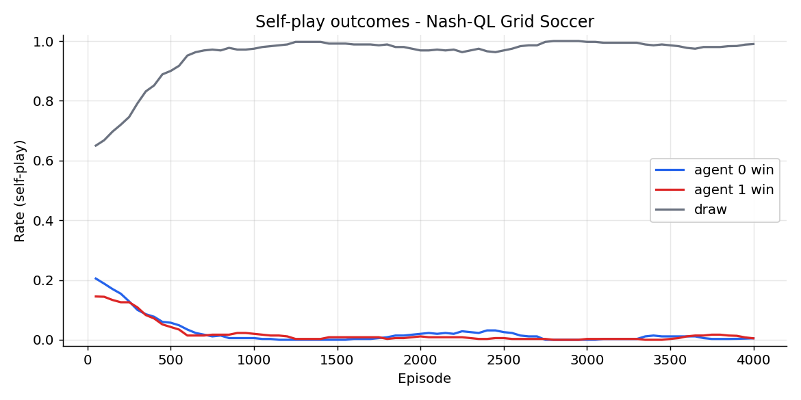
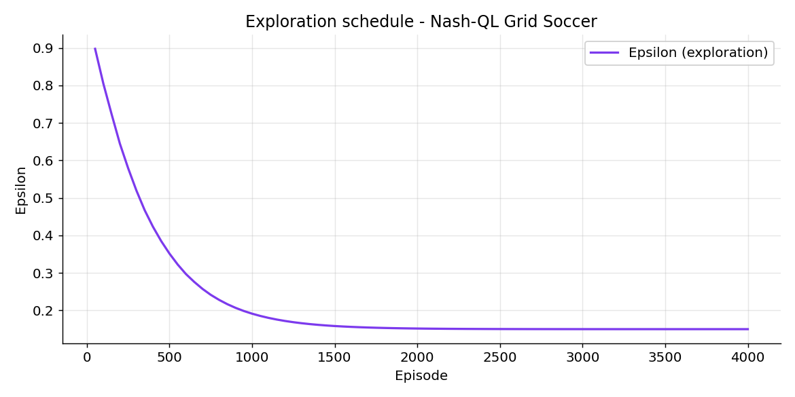

<p align="center">
  
</p>

<table align="center">
<tr>
<td align="center" valign="top"><b>Learned Nash-Q vs random</b><br>agent 0 wins 3/3</td>
<td align="center" valign="top"><b>Learned Nash-Q vs analytical Nash</b><br>2 losses, 1 draw</td>
<td align="center" valign="top"><b>Self-play (learned vs learned)</b><br>5 draws, both agents freeze after step 1</td>
</tr>
<tr>
<td></td>
<td></td>
<td></td>
</tr>
</table>

<p align="center">
  <em>Three matchups on the same 4x5 grid soccer pitch, all using the same trained Nash-Q Q-tables (agent 0, blue). Left: against a <b>random</b> defender the learned policy attacks and scores easily - which sounds impressive but doesn't measure Nash-Q's actual claim. Middle: against the <b>analytical Nash equilibrium</b> opponent (Shapley value iteration, computed below), it loses or draws. Right: <b>self-play</b> - across five different starting positions, both agents each take one move and then freeze in place for the remaining 39 steps of every game. That is what the "100% draws" self-play statistic actually looks like: not a coordinated equilibrium, but a literally-frozen fixed point. The exploitability chart later confirms this is far from the true Nash. Random is a weak opponent; the real gauge is exploitability against a best-responder.</em>
</p>

# Nash Q-Learning (Multi-Agent)

## Overview
Nash Q-learning (Hu and Wellman, 2003) extends Q-learning to stochastic
(Markov) games. Each agent learns Q-values over the **joint** action space and,
at every state, treats those Q-values as the payoff matrices of a one-shot game;
it acts according to a **Nash equilibrium** of that stage game and bootstraps
with the equilibrium value. This implementation trains 2-player self-play on a
**zero-sum grid soccer** game, which is exactly where Nash-Q belongs: for a
zero-sum game the maxmin (security) strategy is the exact Nash equilibrium.

The important thing about this repo relative to typical Nash-Q demos: we ship an
**exact solver** for the same game (Shapley 1953 minimax value iteration), which
turns "beats a random opponent" into the actual game-theoretic evaluation Nash-Q
should be judged by: **exploitability against a best-responding adversary**, and
**head-to-head against the analytical Nash opponent**.

## Highlights
- Joint-action Q-tables `Q[agent, state, a0, a1]` with a per-state minimax LP.
- Zero-sum 2D **grid soccer** env (positions + ball possession, Littman-style steal mechanic, shared joint-state, matplotlib render).
- **Exact minimax solver** (`nash_ql/exact_solver.py`): Shapley VI on the true (unshaped) game, cached to disk. Yields `Q*, V*, pi0*, pi1*` for every state.
- **Exploitability metric**: for the learned equilibrium policy pi, best-response VI computes `V_vs_BR(pi)`, and exploitability = `V*(s) - V_vs_BR(s)`. Zero iff pi is a true Nash equilibrium.
- **Head-to-head vs the analytical Nash opponent** so we can compare the learned policy's mean return against the true game value V*.
- Two policies from one Q: the **equilibrium** policy for self-play, and a **best response** to a known opponent (used for the vs-random eval and the GIF demo).

## What is Nash Q-Learning?
Ordinary Q-learning assumes the agent controls the whole environment. In a game
the transitions and rewards depend on every agent, so the "max over my actions"
target is wrong. Nash Q-learning replaces it: agent $i$ keeps $Q_i(s, a_0, a_1)$
over joint actions, and at each state solves the stage game defined by
$(Q_0(s), Q_1(s))$ for a Nash equilibrium $(\pi_0^*, \pi_1^*)$. It acts from that
equilibrium and bootstraps with its value.

On a **zero-sum** game (like soccer: one team's goal is the other's loss) the
equilibrium is the minimax/security strategy, which the LP solver computes
exactly. Two consequences that show up in the results below:
- **Self-play** should ideally converge to the minimax equilibrium (so the
  average agent-0 return equals V*).
- **Against a known weaker opponent** the equilibrium hedges (it guarantees the
  game value against any opponent); to exploit a random opponent you use the
  best response the learned Q already supports.

## The Math Behind Nash Q-Learning

**Joint-action Nash update.** Each agent updates its joint-action Q toward its
reward plus the discounted Nash value of the next state:

$$
Q_i(s, a_0, a_1) \leftarrow Q_i(s, a_0, a_1) + \alpha \Big[ r_i + \gamma\,(1 - d)\, V_i^{\text{Nash}}(s') - Q_i(s, a_0, a_1) \Big].
$$

**Nash value.** With the stage-game equilibrium $(\pi_0^*, \pi_1^*)$ at $s'$, agent $i$'s value is the expected payoff under it:

$$
V_i^{\text{Nash}}(s') = \pi_0^{*\top} Q_i(s')\, \pi_1^* .
$$

**Zero-sum minimax LP.** For payoff $P = Q_0(s)$ the row player (agent 0) solves

$$
\max_{v,\, \pi_0}\; v \quad \text{s.t.} \quad P^\top \pi_0 \ge v\,\mathbf{1},\;\; \mathbf{1}^\top \pi_0 = 1,\;\; \pi_0 \ge 0,
$$

and agent 1 solves the dual $\min_{u, \pi_1}\; u$ s.t. $P\,\pi_1 \le u\,\mathbf{1}$. By the minimax theorem both give the same value $v = u = V^*(s)$.

**Shapley's algorithm (exact solver).** For a zero-sum stochastic game, iterate

$$
Q^*(s, a_0, a_1) \;\leftarrow\; \mathbb{E}_{s'}\big[r_0(s, a, s') + \gamma\, V^*(s')\big], \qquad V^*(s) \;\leftarrow\; \text{minimax}(Q^*(s)).
$$

This is a $\gamma$-contraction, so it converges to the unique game-value $V^*$. We use it to precompute the ground truth for evaluation.

**Exploitability.** For any policy $\mu$ played by agent 0,

$$
\text{Expl}(\mu; s) \;=\; V^*(s) \;-\; \min_{\nu}\; \mathbb{E}\!\left[\sum_t \gamma^t r_0 \,\middle|\, \mu, \nu\right].
$$

Zero iff $\mu$ is a Nash strategy. We compute the inner minimum by best-response VI (a plain MDP for agent 1 with the environment being `env + mu`).

### Symbol to code map
| Symbol | Meaning | Where in code |
| --- | --- | --- |
| $Q_i(s, a_0, a_1)$ | joint-action Q-tables | `agent.Q` (shape `[2, n_states, n_actions, n_actions]`) |
| $(\pi_0^*, \pi_1^*)$ | stage-game equilibrium | `solve_nash_equilibrium` (general-sum) / `exact_solver._minimax_value` (zero-sum LP) |
| $V_i^{\text{Nash}}$ | equilibrium value | `compute_nash_value` |
| Nash update | TD update | `NashQLearningAgent.update` |
| equilibrium policy | self-play action | `NashQLearningAgent.greedy_actions` |
| best response | exploit a known opponent | `NashQLearningAgent.best_response_action` |
| $Q^*, V^*, \pi^*$ | analytical solution | `exact_solver.shapley_iterate` |
| exploitability | game-theoretic metric | `exact_solver.exploitability` |
| head-to-head | learned pi vs exact opp | `exact_solver.head_to_head_vs_exact` |

## Environment: Grid Soccer
A compact zero-sum Markov soccer game (`nash_ql/envs/grid_soccer.py`), a smaller
version of Littman's (1994) soccer:
- 2 players on a `rows x cols` grid (default 4x5); actions are stay / up / down / left / right.
- One player holds the ball; agent 0 attacks the right goal, agent 1 the left goal (goals span the middle rows). Carrying the ball into your goal scores: +1 to the scorer, -1 to the other (zero-sum).
- **Steal mechanic:** moves resolve in a random order; moving into the other player's cell is blocked, and a carrier that does so loses the ball to the stationary player (this is how defense works).
- **Shared joint state:** both agents observe the same `(pos0, pos1, ball_owner)` index.
- The env exposes a pure `simulate(state, actions, order)` helper (no RNG, no mutation), which lets the exact solver enumerate transitions cleanly.
- **Zero-sum shaping (training only):** a small dense reward for advancing the ball toward the goal (with the negation to the opponent), so attacking is learnable before the first goal while the game stays zero-sum. The exact solver operates on the **unshaped** +/-1 game; that is the ground truth we compare against.

## Quickstart
```bash
python Nash-QL/main.py train --config Nash-QL/configs/grid_soccer.yaml
python Nash-QL/main.py demo  --config Nash-QL/configs/grid_soccer.yaml --model_path Nash-QL/checkpoints_soccer/best.pt
```
The first training run computes the exact Nash solution and caches it (~3 min for a 4x5 pitch); subsequent runs load in milliseconds. Set `exact_eval: false` in the config to skip. `demo` plays the learned agent 0 (best response) against a random opponent. Authenticate with WandB via `--wandb_key YOUR_KEY`, or export `WANDB_API_KEY` (the CLI flag takes precedence).

### Running with uv
```bash
uv venv .venv && uv sync
uv run python Nash-QL/main.py train --config Nash-QL/configs/grid_soccer.yaml
```

## Tests
```bash
python -m pytest tests/nashq/     # 44 tests
```
Tests cover the general-sum LP solver, the zero-sum minimax LP, the agent
(2-agent guard, epsilon decay, Nash update, best response), the grid soccer
dynamics (scoring, steal, shared state, zero-sum shaping, render, `simulate`
matching `step`), the exact solver (Shapley VI convergence, zero exploitability
of pi*, head-to-head hits V*, uniform policy is exploitable), and the train/demo
loops including the exact-eval path.

## Configuration
`Nash-QL/configs/grid_soccer.yaml` exposes the env (`rows`, `cols`, `max_steps`,
`goal_reward`, `shaping`), training (`total_episodes`, `alpha`, `gamma`, epsilon
schedule), evaluation (`eval_interval`, `eval_episodes`, `exact_eval`), and
logging/inference fields.

## Results & analysis

### The exact solver reveals the ground truth
Shapley VI on the unshaped 4x5 game (800 states, ~3 min once, cached) gives:
- `V*(start | ball=0) = +0.2661` and `V*(start | ball=1) = -0.2661` (perfectly anti-symmetric).
- **The game is NOT a draw at the initial position.** Having the ball is worth
  ~0.27 in expected discounted return (gamma=0.95). So a genuinely Nash
  self-play agent would win ~half the games (whichever side has the ball) and
  lose ~half, netting mean return 0.

### How well does Nash-Q converge to the true Nash?

Self-play training for 4000 episodes with exact-eval every 500. Two evaluations
against the analytical Nash opponent and one against random, averaged over the
run:

| Metric | Interpretation | Best value seen | Ideal (Nash) |
| --- | --- | --- | --- |
| **Exploitability at start states** | how much a best-responder beats the learned pi | **0.643** (ep 500) | **0.0** |
| Head-to-head mean-r0 vs exact Nash | learned pi's expected return vs the analytical minimizer | -0.31 (ep 3000) | 0.0 |
| Head-to-head win rate vs exact Nash | how often the learned pi actually scores | 0.00 across all evals | ~0.5 |
| Head-to-head draw rate vs exact Nash | tied games | 0.69 (ep 3000) | ~0.5 |
| Win rate vs random opponent | old benchmark | 0.795 (ep 1000) | (uninformative) |

**Vanilla Nash-Q with epsilon-greedy self-play does not converge to the analytical Nash equilibrium on this game within 4000 episodes.** The learned policy plateaus at exploitability ~0.78 at start states (ideal: 0), and against the analytical Nash opponent it loses ~0.3-0.5 in expected return and never wins a game. The "beats random 74%" number from the previous version of this README hid this - random doesn't stress-test the policy. This matches the literature: Nash-Q's convergence guarantees require strong assumptions (a unique Nash, both agents observing joint rewards and Q updates) that a practical self-play run doesn't satisfy.

### Charts

<p align="center">
  
</p>

*Headline: exploitability at start states (green) vs the ideal Nash line at 0. Nash-Q's learned policy sits ~0.65-0.78 above the true Nash value across training. `save_best` gates on this metric (lower is better).*

<p align="center">
  
</p>

*Head-to-head vs the analytical Nash opponent. Mean agent-0 return (green) stays well below V* = 0 (blue): the learned policy is losing on average. Win rate is essentially zero (behind the V* line); loss rate hovers at 0.30-0.53.*

<p align="center">
  
</p>

*Self-play outcome rates. Two Nash-Q agents playing each other end most games in draws - which used to look like "converged to equilibrium" but the exploitability chart above reveals it's actually a stable non-Nash fixed point where neither side attempts risky attacks.*

<p align="center">
  
</p>

*The epsilon-greedy exploration schedule (kept high long enough for goals to occur during self-play so attacking values can propagate).*

### Why we still keep the vs-random and GIF demos
The best-response policy extracted from the same Q wins ~74% against a random opponent, and the demo GIF shows this. That is a real capability of the learned Q - it just isn't the *game-theoretic* claim Nash-Q is meant to support. The two metrics side-by-side are a useful illustration of how a "beats random" benchmark can look strong on a policy that's actually far from Nash.

### What would close the gap
Follow-ups that likely help (not implemented here): decaying alpha, longer training (the flat exploitability curve suggests a real plateau rather than slow convergence), Friend-or-Foe Q-learning (Littman 2001) for a cleaner zero-sum operator, or a fitted Nash-Q variant. The exploitability metric is the honest gauge for any of them.

## References
- Hu, J., and Wellman, M. P. (2003). Nash Q-learning for general-sum stochastic games. JMLR 4, 1039-1069.
- Shapley, L. S. (1953). Stochastic games. PNAS 39(10), 1095-1100.
- Littman, M. L. (1994). Markov games as a framework for multi-agent reinforcement learning (grid soccer). ICML.
- Littman, M. L. (2001). Friend-or-Foe Q-learning in general-sum games. ICML.
