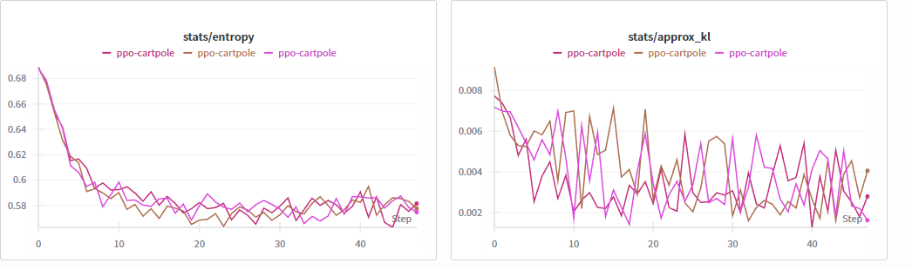
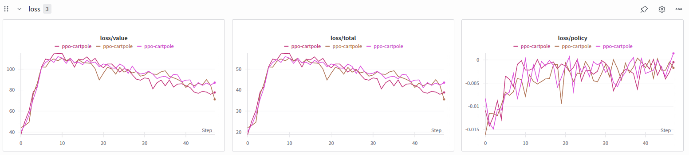
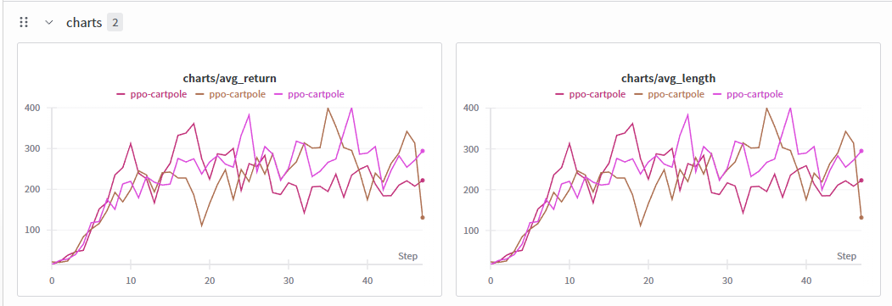

<p align="center">
  
</p>

## PPO (Proximal Policy Optimization) quickstart


<p align="center">
  
</p>

### What is PPO?

- PPO is a policy-gradient algorithm that alternates between collecting rollouts with the current policy and optimizing a clipped surrogate objective to prevent destructive policy updates. It uses an actor-critic network and GAE (Generalized Advantage Estimation) for low-variance advantage targets.

Key equations:

Policy objective with clipping:

$$ L^{CLIP}(\theta)=\mathbb{E}_t\left[\min(r_t(\theta)\,\hat{A}_t,\;\text{clip}(r_t(\theta),\,1-\epsilon,\,1+\epsilon)\,\hat{A}_t)\right] $$

$$ r_t(\theta)=\frac{\pi_\theta(a_t|s_t)}{\pi_{\theta_{\text{old}}}(a_t|s_t)} $$

Value function loss and entropy bonus:

$$ L^{V}(\theta)=\mathbb{E}_t[(V_\theta(s_t)-\hat{R}_t)^{2}] $$

$$ L(\theta)=L^{CLIP}(\theta)-c_1 L^{V}(\theta)+c_2\,\mathbb{E}_t[\mathcal{H}(\pi_\theta(\cdot|s_t))] $$

GAE (advantages):

$$ \delta_{t}=r_{t}+\gamma V(s_{t+1})-V(s_{t}) $$

$$ \hat{A}_{t}=\sum_{l=0}^{T-t-1}(\gamma\lambda)^l\,\delta_{t+l} $$

Where:
- $\hat{A}_t$: advantage estimate at time $t$ (from GAE)
- $\epsilon$: PPO clip range (e.g., `clip_coef` in config)
- $r_t(\theta)$: probability ratio between new and old policies
- $\hat{R}_t$: return target for the value function
- $V_\theta(s_t)$: value function estimate at state $s_t$
- $\mathcal{H}(\pi_\theta(\cdot|s_t))$: policy entropy at state $s_t$

This template includes:
- Clean Config class backed by a YAML file in `PPO/configs/`
- Fire CLI with two commands: `train` and `demo`
- tqdm progress bars
- Weights & Biases logging for rewards and losses
- Checkpoint saving (best and periodic)
- Inference/demo with on-screen rendering

### Training charts

<p align="center">
  
</p>
<p align="center">
  
</p>
<p align="center">
  
</p>

## Quick Commands
```bash
python -m PPO.main train --config PPO/configs/cartpole.yaml
python -m PPO.main demo --config PPO/configs/cartpole.yaml --model_path PPO/checkpoints/best.pt
```

Setup with uv (activate the venv if you want to call `python` directly; `uv run` does not require activation):

Windows cmd:
```cmd
uv venv .venv
uv sync
.\.venv\Scripts\activate.bat
python -m PPO.main train --config PPO/configs/cartpole.yaml
python -m PPO.main demo --config PPO/configs/cartpole.yaml --model_path PPO/checkpoints/best.pt --episodes 5
```

macOS/Linux (bash or zsh):
```bash
uv venv .venv
uv sync
source .venv/bin/activate
python -m PPO.main train --config PPO/configs/cartpole.yaml
python -m PPO.main demo --config PPO/configs/cartpole.yaml --model_path PPO/checkpoints/best.pt --episodes 5
```

If you prefer `uv run` instead of activation:
```bash
uv run -m PPO.main train --config PPO/configs/cartpole.yaml
uv run -m PPO.main demo --config PPO/configs/cartpole.yaml --model_path PPO/checkpoints/best.pt --episodes 5
```

Notes
- Only discrete action spaces and flat observations are supported in this minimal example.
- Rendering requires a local display; ensure `pygame` is installed (already in pyproject).
- You can modify hyperparameters in `PPO/configs/cartpole.yaml`.
