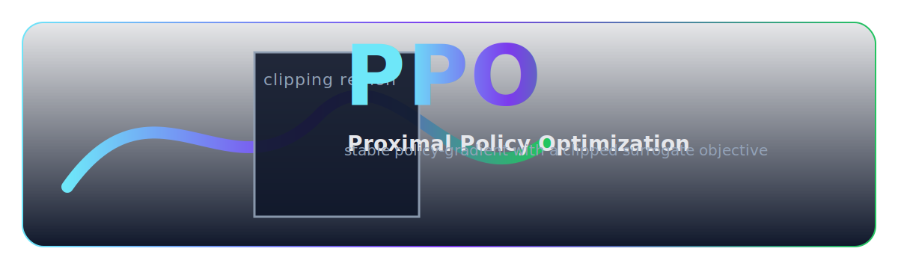

<p align="center">
  
</p>

## PPO (Proximal Policy Optimization) quickstart


<p align="center">
  
</p>

### What is PPO?

- PPO is a policy-gradient algorithm that alternates between collecting rollouts with the current policy and optimizing a clipped surrogate objective to prevent destructive policy updates. It uses an actor-critic network and GAE (Generalized Advantage Estimation) for low-variance advantage targets.

This template includes:
- Clean Config class backed by a YAML file in `PPO/configs/`
- Fire CLI with two commands: `train` and `demo`
- tqdm progress bars
- Weights & Biases logging for rewards and losses
- Checkpoint saving (best and periodic)
- Inference/demo with on-screen rendering

## Quick Commands
```bash
python -m PPO.main train --config PPO/configs/cartpole.yaml
python -m PPO.main demo --config PPO/configs/cartpole.yaml --model_path PPO/checkpoints/best.pt
```

Setup with uv (activate the venv if you want to call `python` directly; `uv run` does not require activation):

Windows cmd:
```cmd
uv venv .venv
uv sync
.\.venv\Scripts\activate.bat
python -m PPO.main train --config PPO/configs/cartpole.yaml
python -m PPO.main demo --config PPO/configs/cartpole.yaml --model_path PPO/checkpoints/best.pt --episodes 5
```

macOS/Linux (bash or zsh):
```bash
uv venv .venv
uv sync
source .venv/bin/activate
python -m PPO.main train --config PPO/configs/cartpole.yaml
python -m PPO.main demo --config PPO/configs/cartpole.yaml --model_path PPO/checkpoints/best.pt --episodes 5
```

If you prefer `uv run` instead of activation:
```bash
uv run -m PPO.main train --config PPO/configs/cartpole.yaml
uv run -m PPO.main demo --config PPO/configs/cartpole.yaml --model_path PPO/checkpoints/best.pt --episodes 5
```

Notes
- Only discrete action spaces and flat observations are supported in this minimal example.
- Rendering requires a local display; ensure `pygame` is installed (already in pyproject).
- You can modify hyperparameters in `PPO/configs/cartpole.yaml`.
