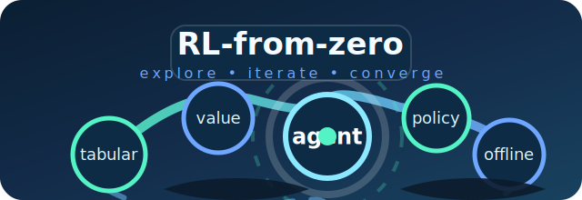
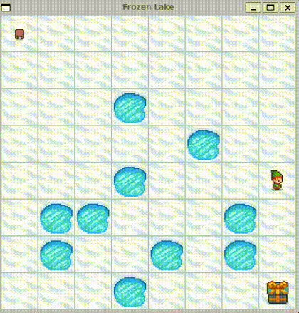
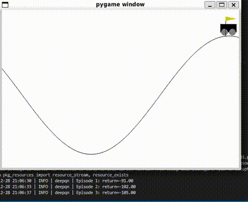
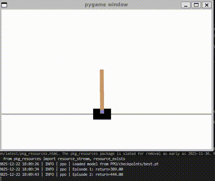
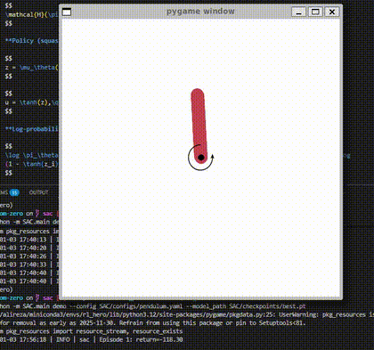

# RL-from-zero

<p align="center">
  
</p>

[](https://www.python.org/)
[](https://github.com/astral-sh/uv)
[](https://github.com/AlirezaShamsoshoara/RL-from-zero/commits)
[](https://github.com/AlirezaShamsoshoara/RL-from-zero/releases)
[](https://peps.python.org/pep-0008/)
[](https://hitsofcode.com/github/AlirezaShamsoshoara/RL-from-zero/view?branch=main)
[](README.md)
[](https://github.com/AlirezaShamsoshoara/RL-from-zero/stargazers)
[](https://github.com/AlirezaShamsoshoara/RL-from-zero/network/members)
[](https://github.com/AlirezaShamsoshoara/RL-from-zero/issues)
[](https://github.com/AlirezaShamsoshoara/RL-from-zero/pulls)
[](LICENSE)

RL-from-zero is a collection of reinforcement learning agents implemented from scratch to refresh RL fundamentals and keep deep learning coding skills sharp. Each algorithm lives in its own self-contained package with a shared command-line interface, YAML-driven configuration, and optional experiment tracking via Weights & Biases.

## Why this repository?
- Revisit classic RL algorithms across discrete and continuous control settings without relying on heavyweight frameworks.
- Compare tabular, value-based, and policy-gradient methods side by side with a consistent project layout.
- Provide a starting point for quick experiments: tweak a YAML file, run a single command, and inspect checkpoints, logs, and metrics.
- Serve as a personal sandbox for extending agents, adding environments, and experimenting with new ideas.
- All gifs demos in the Table below are based on the trained models in this project.

## Algorithms included
| Folder | Algorithm | Action space | Default environment | Demo GIF |
| --- | --- | --- | --- | --- |
| [`Qlearning/`](Qlearning/) | Tabular Q-learning | Discrete | `FrozenLake-v1` (deterministic) |  |
| [`Independent-QL/`](Independent-QL/) | Independent Q-learning (multi-agent) | Discrete | `LineWorld` (custom 2-agent grid) | - |
| [`Nash-QL/`](Nash-QL/) | Nash Q-learning (multi-agent game theory) | Discrete | `LineWorld` (custom 2-agent grid) | - |
| [`deepQN/`](deepQN/) | Deep Q-Network (with Double DQN option) | Discrete | `MountainCar-v0` |  |
| [`PPO/`](PPO/) | Proximal Policy Optimization | Discrete | `CartPole-v1` |  |
| [`MAPPO/`](MAPPO/) | Multi-Agent PPO (centralized critic) | Discrete | `MultiWalker-v9` (PettingZoo) | - |
| [`A3C/`](A3C/) | Asynchronous Advantage Actor-Critic | Discrete | `CartPole-v1` | - |
| [`SAC/`](SAC/) | Soft Actor-Critic | Continuous | `Pendulum-v1` |  |
| [`DDPG/`](DDPG/) | Deep Deterministic Policy Gradient | Continuous | `Pendulum-v1` | - |
| [`MADDPG/`](MADDPG/) | Multi-Agent DDPG (centralized training) | Continuous | `simple_spread_v3` (PettingZoo MPE) | - |
| [`TD3/`](TD3/) | Twin Delayed DDPG | Continuous | `Pendulum-v1` | - |
| [`TRPO/`](TRPO/) | Trust Region Policy Optimization | Continuous | `Pendulum-v1` | - |
| [`IQL/`](IQL/) | Implicit Q-Learning (offline) | Continuous | `Pendulum-v1` (random offline dataset) | - |

All agents expose a two-command Fire CLI (`train` and `demo`), use PyTorch under the hood, and save both periodic and best checkpoints in their respective `checkpoints/` directories.

## Common toolkit
- **Configuration:** YAML files under each `<algo>/configs/` folder feed into a typed `Config` object for reproducible experiments.
- **Logging:** Python logging configured per algorithm, `tqdm` progress bars, and optional Weights & Biases integration (`--wandb_key` argument, `wandb_key` in config, or `WANDB_API_KEY` in your environment for trainers that read it).
- **Checkpoints:** `best.pt` stores the top-performing policy by rolling average return; numbered checkpoints capture intermediate progress.
- **Demos:** `demo` commands load a saved checkpoint, run evaluation rollouts, and render to the screen or console depending on the environment.

## Getting started
1. **Install uv (optional but recommended).**
   - Windows: download the installer from https://github.com/astral-sh/uv.
   - macOS: `brew install uv` (Homebrew) or use the installer linked above.
   - Linux: run the install script from the release page or `pipx install uv`.
2. **Create a virtual environment and install dependencies** (commands are identical on Windows, macOS, and Linux shells):
   ```bash
   uv venv .venv
   uv sync
   ```
   The `pyproject.toml` lists core packages: Gymnasium (classic_control and toy-text extras), NumPy, PyTorch, tqdm, Fire, PyYAML, wandb, and pygame for rendering.
3. **Activate the environment** before running commands:
   - PowerShell:
     ```powershell
     .\.venv\Scripts\Activate.ps1
     ```
   - Command Prompt:
     ```cmd
     .\.venv\Scripts\activate.bat
     ```
   - macOS/Linux shells:
     ```bash
     source .venv/bin/activate
     ```

## Running experiments
Each algorithm can be launched with `python -m <package>.main` from the repository root. Supply a YAML config and optional overrides.

### Tabular examples (Q-learning)
```bash
# Single-agent Q-learning
python -m Qlearning.main train --config Qlearning/configs/frozenlake.yaml
python -m Qlearning.main demo --config Qlearning/configs/frozenlake.yaml --model_path Qlearning/checkpoints/best.pt --episodes 5

# Multi-agent Independent Q-learning
python -m Independent-QL.main train --config Independent-QL/configs/line_world.yaml
python -m Independent-QL.main demo --config Independent-QL/configs/line_world.yaml --model_path Independent-QL/checkpoints/best.pt

# Multi-agent Nash Q-learning (game-theoretic)
python -m Nash-QL.main train --config Nash-QL/configs/line_world.yaml
python -m Nash-QL.main demo --config Nash-QL/configs/line_world.yaml --model_path Nash-QL/checkpoints/best.pt
```

### Multi-agent deep RL examples
```bash
# MAPPO on MultiWalker (PettingZoo)
python -m MAPPO.main train --config MAPPO/configs/multiwalker.yaml
python -m MAPPO.main demo --config MAPPO/configs/multiwalker.yaml --model_path MAPPO/checkpoints/best.pt

# MADDPG on Simple Spread (PettingZoo MPE)
python -m MADDPG.main train --config MADDPG/configs/simple_spread.yaml
python -m MADDPG.main demo --config MADDPG/configs/simple_spread.yaml --model_path MADDPG/checkpoints/best.pt
```

### Discrete deep RL examples
```bash
# PPO on CartPole
python -m PPO.main train --config PPO/configs/cartpole.yaml
python -m PPO.main demo --config PPO/configs/cartpole.yaml --model_path PPO/checkpoints/best.pt

# Deep Q-Network
python -m deepQN.main train --config deepQN/configs/mountaincar.yaml
python -m deepQN.main demo --config deepQN/configs/mountaincar.yaml --model_path deepQN/checkpoints/best.pt

# A3C with multiple workers
python -m A3C.main train --config A3C/configs/cartpole.yaml
python -m A3C.main demo --config A3C/configs/cartpole.yaml --model_path A3C/checkpoints/best.pt --episodes 5
```

### Continuous control examples
```bash
# Soft Actor-Critic
python -m SAC.main train --config SAC/configs/pendulum.yaml
python -m SAC.main demo --config SAC/configs/pendulum.yaml --model_path SAC/checkpoints/best.pt

# Deep Deterministic Policy Gradient
python -m DDPG.main train --config DDPG/configs/pendulum.yaml
python -m DDPG.main demo --config DDPG/configs/pendulum.yaml --model_path DDPG/checkpoints/best.pt

# Twin Delayed DDPG
python -m TD3.main train --config TD3/configs/pendulum.yaml
python -m TD3.main demo --config TD3/configs/pendulum.yaml --model_path TD3/checkpoints/best.pt

# Trust Region Policy Optimization
python -m TRPO.main train --config TRPO/configs/pendulum.yaml
python -m TRPO.main demo --config TRPO/configs/pendulum.yaml --model_path TRPO/checkpoints/best.pt

# Implicit Q-Learning (offline)
python -m IQL.main train --config IQL/configs/pendulum_random.yaml
python -m IQL.main demo --config IQL/configs/pendulum_random.yaml --model_path IQL/checkpoints/best.pt
```

### Optional Weights & Biases logging
Add `--wandb_key YOUR_KEY` to any `train` command or set `wandb_key` in the YAML config to authenticate and push metrics, losses, and episode returns to W&B. If `WANDB_API_KEY` is set in your environment, trainers that check the env var (for example, PPO and SAC) will read it automatically.

## Configuring experiments
- Duplicate a baseline YAML file (for example `PPO/configs/cartpole.yaml`) and edit environment ids, learning rates, rollout lengths, or logging cadence.
- All configs share naming conventions (`env_id`, `total_steps` or `total_timesteps`, `checkpoint_interval`, etc.), so switching algorithms feels familiar.
- Continuous control agents expose additional knobs like replay buffer sizes, target smoothing noise, and entropy targets.

## Tests
A small but growing `tests/` folder captures unit tests. Run them with Python's unittest CLI:
```bash
python -m unittest tests.deepqn.test_replay_buffer
```

## Repository layout
```
RL-from-zero/
|-- A3C/            # Async advantage actor-critic implementation
|-- PPO/            # Proximal policy optimization agent
|-- MAPPO/          # Multi-agent PPO (centralized training, decentralized execution)
|-- Qlearning/      # Tabular Q-learning agent
|-- Independent-QL/ # Multi-agent Independent Q-learning
|-- Nash-QL/        # Multi-agent Nash Q-learning (game theory)
|-- deepQN/         # Deep Q-Network agent
|-- SAC/            # Soft Actor-Critic agent
|-- DDPG/           # Deep Deterministic Policy Gradient agent
|-- MADDPG/         # Multi-Agent DDPG (centralized training, decentralized execution)
|-- TD3/            # Twin Delayed DDPG agent
|-- TRPO/           # Trust Region Policy Optimization agent
|-- IQL/            # Implicit Q-Learning (offline) agent
|-- tests/          # Unit tests (currently deepQN replay buffer coverage)
|-- pyproject.toml
|-- uv.lock
`-- README.md       # You are here
```

## License
This project is licensed under the MIT License. See `LICENSE` for the full text.

## References
Each subdirectory README links to seminal papers and additional resources for that algorithm. Use them as a launchpad for deeper study or for extending the agents.

Happy experimenting!

<!-- [](https://www.star-history.com/#AlirezaShamsoshoara/RL-from-zero&Date) -->
