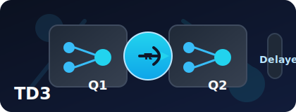

<p align="center">
  
</p>

# Twin Delayed DDPG (TD3)

## Overview
TD3 is an off-policy actor-critic algorithm for continuous action spaces that improves upon DDPG with twin Q-networks, delayed policy updates, and target policy smoothing. This implementation follows the same project layout as the other agents in this repository (PPO, SAC, DQN, etc.).

## What is TD3?
TD3 (Twin Delayed Deep Deterministic Policy Gradient) is designed for continuous control. It stabilizes DDPG with three core ideas: clipped double Q-learning, delayed policy updates, and target policy smoothing.

For each transition $(s_t, a_t, r_t, s_{t+1}, d_t)$, TD3 builds a target with the minimum of two target critics:

$$
y_t = r_t + \gamma(1 - d_t)\min_{i \in \{1,2\}} Q_{\theta_i'}(s_{t+1}, \tilde{a}_{t+1})
$$

Target policy smoothing adds clipped noise to the target action:

$$
\tilde{a}_{t+1} = \mathrm{clip}\!\left(\mu_{\phi'}(s_{t+1}) + \epsilon,\; a_{\min},\; a_{\max}\right), \quad
\epsilon = \mathrm{clip}(\varepsilon,\,-c,\,c), \; \varepsilon \sim \mathcal{N}(0,\sigma^2)
$$

Each critic minimizes an MSE loss:

$$
\mathcal{L}(\theta_i) = \mathbb{E}\left[\left(Q_{\theta_i}(s_t, a_t) - y_t\right)^2\right], \quad i \in \{1,2\}
$$

The actor is updated less frequently (every `policy_delay` critic updates) using the deterministic policy objective:

$$
J(\phi) = \mathbb{E}_{s_t \sim \mathcal{D}}\left[Q_{\theta_1}(s_t, \mu_\phi(s_t))\right]
$$

$$
\nabla_\phi J(\phi) =
\mathbb{E}_{s_t \sim \mathcal{D}}
\left[
\nabla_a Q_{\theta_1}(s_t, a)\big|_{a=\mu_\phi(s_t)}
\cdot
\nabla_\phi \mu_\phi(s_t)
\right]
$$

Target networks are updated with Polyak averaging:

$$
\theta_i' \leftarrow \tau \theta_i + (1-\tau)\theta_i', \quad
\phi' \leftarrow \tau \phi + (1-\tau)\phi'
$$

During data collection, the behavior action is typically:

$$
a_t = \mathrm{clip}\!\left(\mu_\phi(s_t) + \eta_t,\; a_{\min},\; a_{\max}\right), \quad
\eta_t \sim \mathcal{N}(0,\sigma_{\text{explore}}^2)
$$

## Highlights
- Deterministic policy network with twin critics and Polyak-averaged targets.
- Configurable policy delay, exploration noise, target smoothing noise, and random-action exploration pulses for sparse-reward tasks.
- Replay buffer and warm-up phase shared with the other off-policy agents.
- Built-in WandB logging, tqdm-aware logging utilities, and checkpoint management.

## Quickstart
```bash
python -m TD3.main train --config TD3/configs/mountaincar_continuous.yaml

python -m TD3.main demo --config TD3/configs/mountaincar_continuous.yaml --model_path TD3/checkpoints/best.pt
```
Use <code>--wandb_key YOUR_KEY</code> to authenticate for logging, or set <code>WANDB_API_KEY</code> in your environment. Checkpoints live in <code>TD3/checkpoints</code>, and the moving-average best checkpoint is written to <code>best.pt</code>.

## Configuration
YAML files under <code>TD3/configs/</code> expose the hyper-parameters:
- <strong>Environment</strong>: Gym id, render mode, and optional keyword arguments.
- <strong>Training</strong>: interaction steps, warm-up horizon, batch size, replay capacity, learning rates, Polyak coefficient, target noise, noise clip, policy delay, and exploration noise.
- <strong>Model</strong>: shared hidden layer sizes and activation for actor and critics.
- <strong>Logging</strong>: intervals, checkpoint cadence, output paths, and logger behaviour.
- <strong>Inference</strong>: default checkpoint and number of evaluation episodes.

Clone the provided TD3 config in <code>TD3/configs/</code> to target other continuous-control tasks.

## References
- Fujimoto et al., Addressing Function Approximation Error in Actor-Critic Methods, ICML 2018.
- OpenAI Spinning Up TD3: https://spinningup.openai.com/en/latest/algorithms/td3.html
- Stable-Baselines3 TD3: https://stable-baselines3.readthedocs.io/en/master/modules/td3.html
