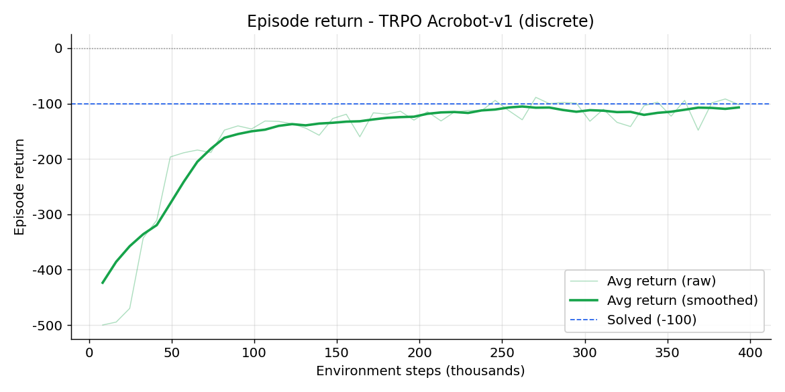
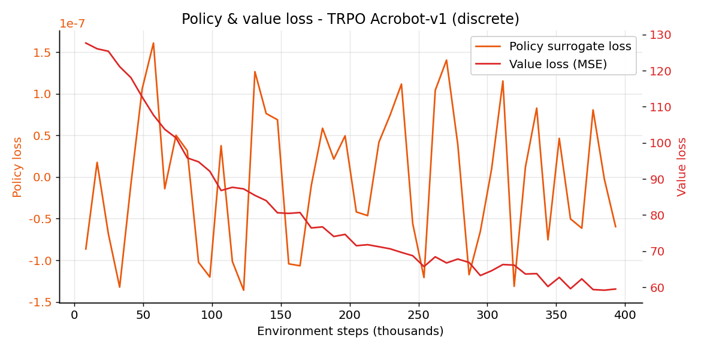
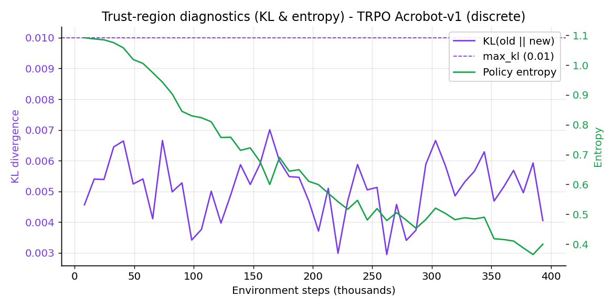
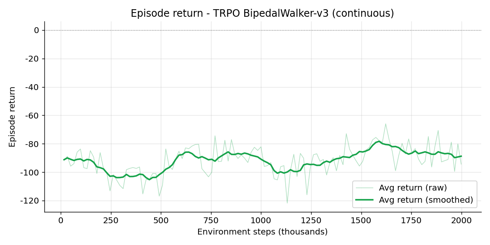

<p align="center">
  
</p>

<p align="center">
  
</p>

<p align="center">
  <em>TRPO swinging up <code>Acrobot-v1</code> (discrete policy, stochastic eval: -104 mean return, 47% of episodes reach the goal).</em>
</p>

# Trust Region Policy Optimization (TRPO)

## Overview
TRPO is an on-policy actor-critic method that improves the policy by the largest step that stays inside a trust region defined by a KL-divergence bound. This implementation supports **both continuous (`Box`) and discrete (`Discrete`) action spaces**, uses Generalized Advantage Estimation (GAE) with a separate value baseline, and follows the structure of the other agents in this repo (PPO, SAC, TD3, etc.).

## Highlights
- Trust-region update solved with conjugate gradient + Fisher-vector products and a backtracking line search.
- One policy interface, two heads: tanh-Gaussian for continuous actions, categorical for discrete actions.
- GAE advantages, a separate value network, KL / entropy / line-search diagnostics, and WandB logging.
- Vectorized Gym environments, tqdm progress, checkpoint helpers, and deterministic-or-sampled evaluation.

## What is TRPO?
TRPO (Schulman et al., 2015) is a **policy-gradient** method built around one idea: take the biggest improvement step you can while keeping the new policy *close* to the old one, where "close" is measured by KL divergence. Staying inside this **trust region** avoids the destructive, too-large updates that plain policy gradients can take.

- **Actor** $\pi_\theta(a \mid s)$ - the policy. Continuous actions use a tanh-squashed diagonal Gaussian; discrete actions use a softmax categorical.
- **Critic** $V_\phi(s)$ - a value baseline trained by regression, used to form GAE advantages.

Each update maximizes a surrogate objective subject to a hard KL constraint. Because that constrained problem has no closed form for deep nets, TRPO approximates it: a linear model of the objective and a quadratic (Fisher) model of the KL give a natural-gradient step, computed with conjugate gradient, then shrunk by a line search until the real KL and improvement checks pass.

## The Math Behind TRPO

**Constrained objective.** TRPO maximizes the importance-sampled surrogate advantage subject to a trust-region (KL) constraint:

$$
\max_{\theta}\ \ \mathbb{E}_{s,a \sim \pi_{\text{old}}}\left[ \frac{\pi_\theta(a \mid s)}{\pi_{\text{old}}(a \mid s)}\, A^{\pi_{\text{old}}}(s, a) \right]
\quad \text{subject to} \quad
\mathbb{E}_{s \sim \pi_{\text{old}}}\big[ D_{\mathrm{KL}}(\pi_{\text{old}} \,\|\, \pi_\theta) \big] \le \delta .
$$

**Advantages (GAE).** Advantages use Generalized Advantage Estimation with the value baseline $V_\phi$:

$$
\delta_t = r_t + \gamma\,(1 - d_t)\, V_\phi(s_{t+1}) - V_\phi(s_t),
\qquad
\hat A_t = \sum_{l \ge 0} (\gamma \lambda)^l\, \delta_{t+l} .
$$

**Linear-quadratic approximation.** Let $g = \nabla_\theta L(\theta)$ be the surrogate gradient and $F$ the Fisher information matrix (the Hessian of the mean KL at $\theta_{\text{old}}$). TRPO solves for the natural-gradient direction

$$
F x = g
$$

with **conjugate gradient**, never forming $F$ explicitly: it only needs Fisher-vector products $F v = \nabla_\theta\big( (\nabla_\theta \overline{D}_{\mathrm{KL}})^\top v \big)$ (plus a small damping $\;+\,\eta v$).

**Step size and line search.** The largest step along $x$ that respects the KL bound is

$$
\theta_{\text{new}} = \theta_{\text{old}} + \alpha\, \sqrt{\frac{2\delta}{x^\top F x}}\; x ,
$$

and a backtracking line search shrinks $\alpha \in \{1, c, c^2, \dots\}$ until the measured KL is $\le \delta$ **and** the surrogate actually improves; otherwise the update is rejected.

**Value update.** The critic minimizes the mean-squared error to the GAE returns $\hat R_t = \hat A_t + V_\phi(s_t)$:

$$
L_V(\phi) = \mathbb{E}_t\big[ (V_\phi(s_t) - \hat R_t)^2 \big] .
$$

**KL per action type.** The constraint uses the closed-form KL of the policy distribution: a **diagonal-Gaussian** KL for continuous actions, and a **categorical** KL $\sum_i p^{\text{old}}_i (\log p^{\text{old}}_i - \log p^{\text{new}}_i)$ for discrete actions.

### Algorithm summary
1. Roll out the current policy for a batch of steps; record actions, log-probs, rewards, values.
2. Compute GAE advantages $\hat A_t$ and returns $\hat R_t$.
3. Compute the surrogate gradient $g$; solve $F x = g$ by conjugate gradient.
4. Take the trust-region step with a backtracking line search on KL + improvement.
5. Fit the value network to $\hat R_t$ for a few gradient steps. Repeat.

### Symbol to code map
| Symbol | Meaning | Where in code |
| --- | --- | --- |
| $\pi_\theta$ | policy (actor) | `GaussianPolicy` / `CategoricalPolicy` in `trpo/networks.py` |
| $V_\phi$ | value baseline | `ValueNetwork`; `agent.value_fn` |
| $L(\theta)$ | surrogate objective | `surrogate()` in `TRPOAgent.update` |
| $\hat A_t$, $\hat R_t$ | GAE advantage / return | `TRPOAgent.compute_gae` |
| $F x = g$ | natural gradient solve | `_conjugate_gradient`, `fisher_vector_product` |
| $\delta$ | KL trust-region bound | `max_kl` |
| line search | KL + improvement backtrack | `TRPOAgent._line_search` (`line_search_coef`, `line_search_steps`) |
| $D_{\mathrm{KL}}$ | policy KL (Gaussian / categorical) | `policy.kl(...)` |

## Environments
TRPO is trained here on two distinct tasks to exercise both policy heads and to compare continuous vs. discrete control:

- **`Acrobot-v1`** (discrete, 3 actions) - the showcase. A two-link swing-up task that TRPO solves quickly and cleanly.
- **`BipedalWalker-v3`** (continuous, `Box(4)`) - a harder locomotion benchmark used as the continuous comparison.

## Quickstart
```bash
# Discrete showcase (Acrobot)
python -m TRPO.main train --config TRPO/configs/acrobot.yaml
python -m TRPO.main demo  --config TRPO/configs/acrobot.yaml --model_path TRPO/checkpoints_acrobot/best.pt

# Continuous comparison (BipedalWalker)
python -m TRPO.main train --config TRPO/configs/bipedalwalker.yaml
python -m TRPO.main demo  --config TRPO/configs/bipedalwalker.yaml --model_path TRPO/checkpoints_bipedalwalker/best.pt
```
Authenticate with WandB via `--wandb_key YOUR_KEY`, or export `WANDB_API_KEY` in your environment (the CLI flag takes precedence) - matching the PPO / SAC / TD3 / A3C / DDPG convention. Checkpoints and the best-so-far `best.pt` snapshot are written under each config's `checkpoint_dir`.

### Running with uv
```bash
uv venv .venv
uv sync                              # installs deps incl. gymnasium[box2d], matplotlib, imageio
uv run python -m TRPO.main train --config TRPO/configs/acrobot.yaml
```
BipedalWalker needs Box2D. It ships via `gymnasium[box2d]`; if a fresh env lacks it: `uv pip install "gymnasium[box2d]"`.

## Tests
```bash
# from the repo root (conda env rlhero, or any env with the deps installed)
python -m pytest tests/trpo/

# or with uv
uv run python -m pytest tests/trpo/
```
The tests use stubbed environments and cover both the Gaussian and categorical paths (action bounds/dtypes, a trust-region update that respects `max_kl`, GAE, and the train/demo loops).

## Configuration
YAML files in `TRPO/configs/` expose the experiment knobs:
- **Environment**: Gym id, render mode, vectorized env count, and optional `env_kwargs`.
- **Training**: total timesteps, rollout horizon, discount/GAE factors, KL bound, conjugate-gradient settings, line-search coefficients, value-fit steps, and entropy bonus.
- **Model**: shared hidden sizes and activation for the policy and value networks.
- **Logging / Inference**: checkpoint cadence, log paths, WandB metadata, eval episode count, and `eval_deterministic`.

## Training results & analysis
Both runs trained offline (seed 0). The headline is a clean demonstration of where TRPO shines and where it struggles, plus a discrete-policy gotcha.

| Run | Action space | Steps | Best avg return (train) | Eval (30 ep) | Solved |
| --- | --- | --- | --- | --- | --- |
| Acrobot-v1 | discrete | 400k | -88.7 | **-104 (stochastic)** | 47% (bar -100) |
| BipedalWalker-v3 | continuous | 2M | -66.0 | **-33 (deterministic)** | 0% (bar 300) |

**Acrobot (discrete) is the better result.** It learns a clear swing-up, climbing from -500 to near the solved line (-100) within ~250k steps, and visibly reaches the goal about half the time.

**A discrete-policy gotcha worth knowing:** Acrobot's **greedy (argmax) policy is pathological** (-459 mean, 10% solved) while **sampling** from the same policy is good (-104 mean, 47% solved). Argmax can lock the acrobot into a non-swinging cycle; the categorical policy needs its stochasticity. The repo handles this with an `eval_deterministic` config flag (set `false` for Acrobot) and a `--stochastic` flag on the GIF tool.

**BipedalWalker (continuous) is the harder case.** Vanilla TRPO at 2M steps learns a stable, non-falling posture (deterministic eval -33 +/- 6, very low variance) but does not reach a forward-walking gait (solved is 300). This matches the literature: TRPO is robust but sample-hungry on locomotion, where PPO and SAC do better. Its demo is included below for contrast.

<p align="center">
  
</p>

<p align="center">
  <em>BipedalWalker-v3 (continuous): a stable stance that avoids falling, but not yet a walking gait.</em>
</p>

### Training charts
Charts below are from the Acrobot showcase run.

<p align="center">
  
</p>

*Episode return climbs from -500 to the solved line (-100). Steady progress is the trust region doing its job.*

<p align="center">
  
</p>

*Policy surrogate loss and value loss (MSE). The value baseline error falls as returns become predictable.*

<p align="center">
  
</p>

*Trust-region diagnostics: per-update KL stays under the `max_kl=0.01` bound (the line search enforces it), while policy entropy decays as the policy sharpens.*

For the continuous run, the BipedalWalker return curve is below for reference.

<p align="center">
  
</p>

## References
- Schulman et al., Trust Region Policy Optimization, ICML 2015 https://arxiv.org/abs/1502.05477
- Schulman et al., High-Dimensional Continuous Control Using Generalized Advantage Estimation, ICLR 2016 https://arxiv.org/abs/1506.02438
- OpenAI Spinning Up TRPO: https://spinningup.openai.com/en/latest/algorithms/trpo.html
