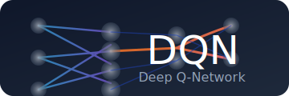

<p align="center">
  
</p>

# Deep Q-Network (DQN)

<p align="center">
  
</p>


## What is DQN?
Deep Q-Networks (DQN) use a neural network to approximate the action-value function for a Markov decision process. The return from time step $t$ is
$$
G_t = \sum_{k=0}^{\infty} \gamma^k r_{t+k+1},
$$
and the action-value function for policy $\pi$ is
$$
Q^\pi(s, a) = \mathbb{E}\left[ G_t \mid s_t = s, a_t = a \right].
$$
The optimal action-value function satisfies the Bellman optimality equation:
$$
Q^*(s, a) = \mathbb{E}\left[ r_{t+1} + \gamma \max_{a'} Q^*(s_{t+1}, a') \mid s_t = s, a_t = a \right].
$$

DQN approximates $Q^*(s, a)$ with a neural network $Q(s, a; \theta)$ and learns $\theta$ by minimizing the temporal-difference (TD) error. Given a transition $(s, a, r, s', \text{done})$ sampled from a replay buffer, the target is
$$
y = r + \gamma (1 - \text{done}) \max_{a'} Q(s', a'; \theta^-),
$$
where $\theta^-$ denotes parameters of a separate target network held fixed for multiple updates. The loss is the mean-squared TD error:
$$
L(\theta) = \mathbb{E}_{(s,a,r,s') \sim \mathcal{D}} \left[ \left( y - Q(s, a; \theta) \right)^2 \right].
$$
Stochastic gradient descent (or a variant like Adam) minimizes $L(\theta)$ using minibatches from the replay buffer $\mathcal{D}$. The behavior policy is typically $\epsilon$-greedy:
$$
a_t =
\begin{cases}
\text{random action} & \text{with probability } \epsilon, \\
\arg\max_a Q(s_t, a; \theta) & \text{with probability } 1 - \epsilon.
\end{cases}
$$

Optionally, Double DQN reduces overestimation by decoupling action selection and evaluation:
$$
y = r + \gamma (1 - \text{done}) Q\left(s', \arg\max_{a'} Q(s', a'; \theta); \theta^- \right).
$$
This implementation mirrors the repository structure used for PPO, A3C, SAC, and tabular Q-learning, delivering an off-policy value-based agent for discrete-action Gymnasium tasks such as `MountainCar-v0`.

## Features
- Torch-based Q-network with target network syncs and optional Double DQN updates.
- Replay buffer, warmup period, and configurable exploration schedule.
- Weights & Biases logging, tqdm-compatible logging helpers, and checkpoint handling aligned with the other algorithms.
- YAML-driven hyperparameters with `Config.from_yaml` parity across the repository.

## Quickstart
```bash
python -m deepQN.main train --config deepQN/configs/mountaincar.yaml
```
Provide `--wandb_key YOUR_KEY` to authenticate for cloud logging. Checkpoints land in `deepQN/checkpoints`, and the best moving-average model is saved as `best.pt`.

To run evaluation rollouts:
```bash
python -m deepQN.main demo --config deepQN/configs/mountaincar.yaml --model_path deepQN/checkpoints/best.pt
```

## Configuration
All tunables live under `deepQN/configs/`. The default `mountaincar.yaml` exposes the following groups and keys:

A concise excerpt of the default setup:
```yaml
# Experiment tracking
project: rl-practice
run_name: dqn-mountaincar

# Environment
env_id: MountainCar-v0
seed: 42

# Training
total_steps: 100000
batch_size: 64
lr: 0.0005
```
Clone the YAML template to configure other discrete-control environments.

## References
- [Playing Atari with Deep Reinforcement Learning](https://arxiv.org/pdf/1312.05602)
- [PyTorch @ Reinforcement Learning (DQN) Tutorial](https://docs.pytorch.org/tutorials/intermediate/reinforcement_q_learning.html)
- [HF @ The Deep Q-Learning Algorithm
](https://huggingface.co/learn/deep-rl-course/en/unit3/deep-q-algorithm)
- Mnih et al., "Human-level control through deep reinforcement learning" (2015)
- OpenAI Baselines DQN: https://github.com/openai/baselines/tree/master/baselines/deepq
- Stable-Baselines3 DQN: https://stable-baselines3.readthedocs.io/en/master/modules/dqn.html
